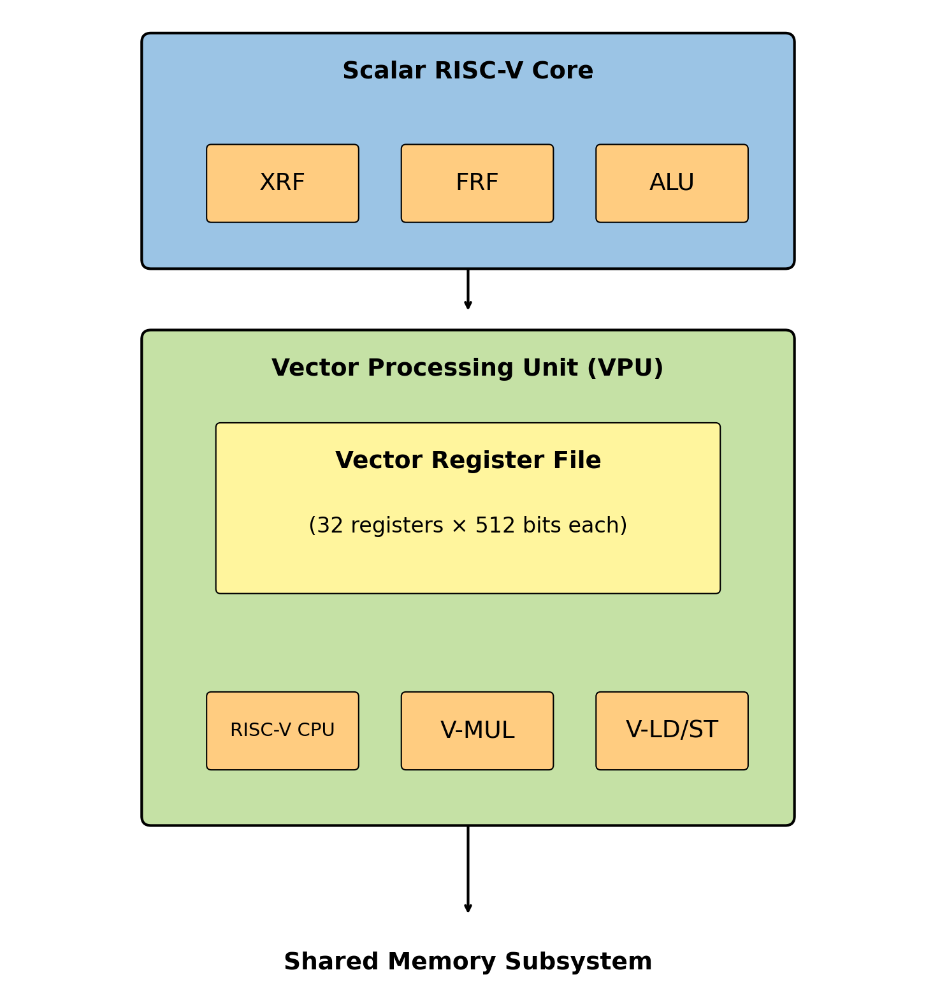
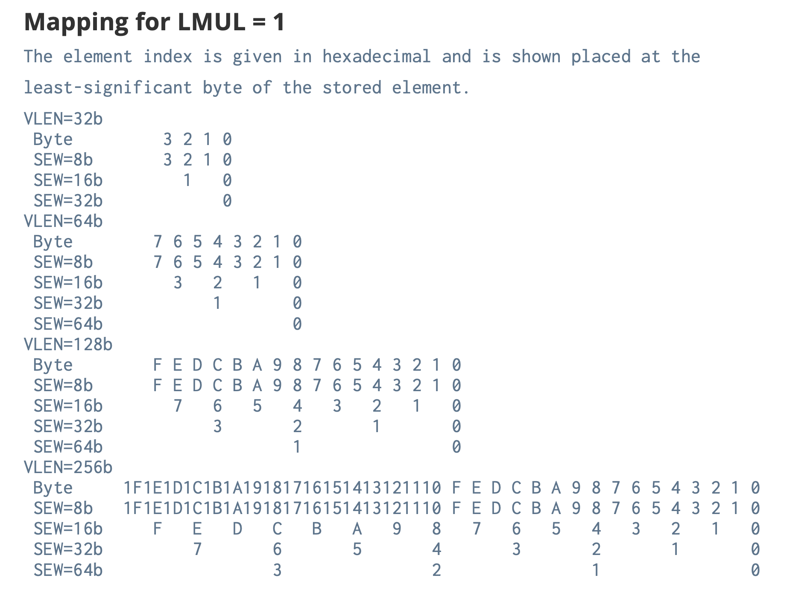
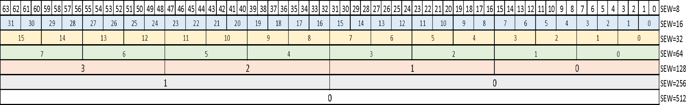
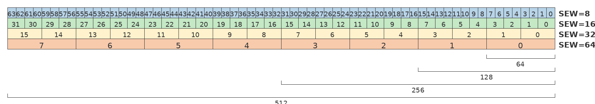
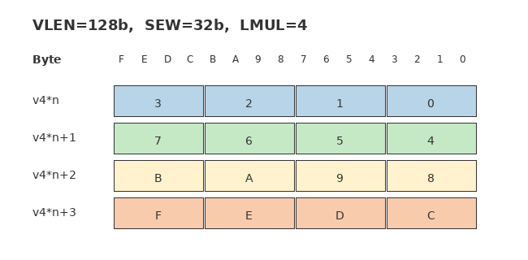
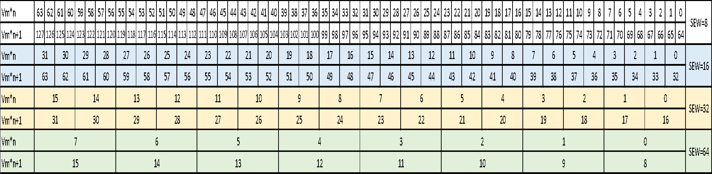
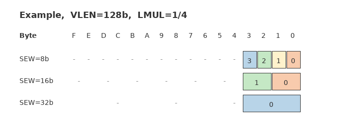
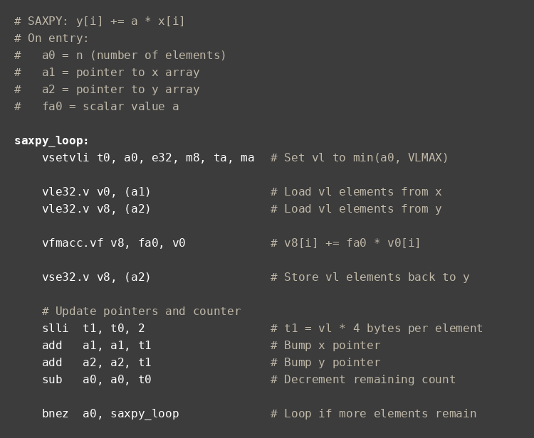

# 第 2 章：从概念到芯片：RISC-V 向量处理器的实现

> 本文是 *RISC-V Vector Primer* 的非官方中文译文，经原作者邮件许可，用于非商业技术教育。
>
> 原作者：Thang Minh Tran、Paul Miller；编辑：Jonah McLeod；出版方：Simplex Micro。中文翻译：Ch'in。
>
> [英文原作](https://github.com/simplex-micro/riscv-vector-primer) · 依据版本：`fc66957a6458842beeabe9d85065ff334ccbd333`（2026-07-25）。授权摘要及译注原则见[翻译说明](TRANSLATION-NOTICE.md)。原作者未审校中文译文。
>
> **支持原作：**作者特别欢迎中文读者访问 [Simplex Micro 官网](https://www.simplexmicro.com)，并分享阅读反馈与改进建议。文末附有反馈说明。

第 1 章为理解 RISC-V 向量扩展打下了概念基础：向量处理器与定宽 SIMD 有何不同，RVV 为什么能够伸缩，以及 VLEN、SEW、LMUL、VL、掩码和链式执行如何共同构成这套模型。

本章进一步走进硬件，看看这些概念如何落到具体设计中。我将以自己设计的一款 512 位 RVV 处理器核为例，贯穿全章展开讨论。

我会先区分三类经常混淆的参数：可配置、可扩展和可编程；然后依次讨论：

- 如何把向量单元组织为协处理器；
- 链式执行和通道如何在真实芯片中工作；
- 为什么 512 位向量寄存器文件既强大又难以实现；
- 如何控制寄存器文件的端口开销，并避免代价高昂的寄存器重命名；
- 这种向量处理器最适合哪些实际应用。

如果说第 1 章解释了向量架构*为什么*采用这种形态，那么本章讨论的就是*如何*真正把它构建出来。

---

## 2.1 RISC-V 生态

设计这款 RISC-V 向量处理器时，我给自己定下了几个目标：

- 构建可用于量产产品的 RVV 处理器核；
- 能够从小型嵌入式设计配置到更大的计算引擎；
- 在性能、功耗和面积方面具有竞争力；
- 最重要的是，遵循已经批准的 RVV 规范，而不是形成私有分支。

最终设计采用 VLEN=512 位配置时，单个 LMUL=8 寄存器组的容量达到 4096 位，与经典 Cray-1 的单个向量寄存器相当；整套向量单元则集成在现代 64 位 RISC-V 处理器核中。

---

## 2.2 可配置、可扩展、可编程：三个灵活性维度

在深入向量架构之前，我想先澄清三个会反复出现的词：

1. 可配置（configurable）；
2. 可扩展（extensible）；
3. 可编程（programmable）。

它们听起来相似，解决的却是不同问题。

### 2.2.1 可配置：构建时确定

“可配置”参数在处理器核生成或综合时选定，运行期间不会改变。例如：

- L1 缓存容量，如 32 KB 或 64 KB；
- 缓存存储阵列采用 ECC、奇偶校验，还是不使用校验；
- VLEN，如 128、256 或 512 位向量寄存器；
- 支持哪些元素位宽和数据格式；原文以仅实现半精度、单精度浮点的配置为例；
- 是否包含某些可选单元和指令，例如 FPU。

一旦选定某个配置，例如 VLEN=512 位、L1=32 KB，这些参数就固定在该处理器核实例中。

> **译注：**“可配置”不意味着可以任意裁剪标准必选功能。实现必须满足其声明支持的扩展要求：例如完整 V 扩展要求支持 FP32 和 FP64，较小的实现可以选择适用的 Zve 子集；FP16 等格式还涉及其他扩展。SEW 也不能单独决定数据采用哪种浮点格式。

### 2.2.2 可扩展：ISA 扩展与自定义指令

“可扩展”是指在基础 ISA 上增加指令，包括：

- 整数乘除、FPU、DSP、向量等标准扩展；
- 通常由 SoC 或系统公司为专用加速器定义的自定义指令。

RISC-V 明确为标准扩展和自定义扩展保留了操作码空间。RVV 本身是一项标准扩展，而自研张量加速器则可以通过自定义扩展接入。

### 2.2.3 可编程：软件在运行时确定

“可编程”参数由正在运行的软件设置，包括：

- **SEW（Selected Element Width，选定元素位宽）：**软件从实现支持的合法配置中选择 8、16、32 或 64 位；其他浮点格式的支持则由相应扩展决定；
- **LMUL（寄存器分组倍数）；**
- **VL（向量长度）。**

这些参数通过 `vtype`、`vl` 等向量 CSR 和 `vsetvl*` 等向量配置指令设置。它们可以在不同循环乃至不同代码块之间变化，而底层硬件无需改变。

SEW 与 LMUL 共同决定 VLMAX，即一条向量指令最多能够处理的元素数：

| `vlmul[2:0]` | LMUL | VLMAX | 寄存器组数量 |
|---|---:|---:|---:|
| `101` | 1/8 | VLEN/(SEW×8) | 32 |
| `110` | 1/4 | VLEN/(SEW×4) | 32 |
| `111` | 1/2 | VLEN/(SEW×2) | 32 |
| `000` | 1 | VLEN/SEW | 32 |
| `001` | 2 | 2×VLEN/SEW | 16 |
| `010` | 4 | 4×VLEN/SEW | 8 |
| `011` | 8 | 8×VLEN/SEW | 4 |

**图 2-1　不同 LMUL 设置下的 VLMAX 计算。**`VLMAX = LMUL × VLEN / SEW`，表示一条向量指令最多能够操作的元素数。对于本章描述的 512 位实现，若 SEW=32 位，则 LMUL=1 时 VLMAX=16，LMUL=8 时 VLMAX=128。

*改编自《RISC-V Vector Extension Specification, Version 1.0》。*

RVV 的强大之处在于同时结合了这三个维度：

- 硬件设计者选择 VLEN、通道数量等**可配置**参数；
- ISA 架构师和系统集成者决定 DSP、向量和自定义操作码等**可扩展**部分；
- 软件在运行时选择**可编程**向量参数，以匹配实际数据形状。

---

## 2.3 在 RISC-V 体系中理解向量扩展

RISC-V 起源于加州大学伯克利分校，目标是建立一套简单、清晰、可复用的开放 ISA。RISC-V 基金会于 2015 年成立，后来演变为 RISC-V International，并迅速吸引了全球数百家成员。

从硬件设计者的角度看，我尤其看重 RISC-V 的简洁。它主要体现在：

- 整数算术通常使用 `x0`～`x31` 中的寄存器操作数或指令内的立即数，不直接以数据内存为算术操作数；
- 源、目的寄存器字段在指令中的位置固定，使译码更简单。RISC-V ISA 体现了硬件设计视角：寄存器操作数必须经过数据依赖检查，而立即数不存在寄存器依赖，因此立即数字段可以分散编码，以优先保持寄存器字段位置固定；
- 基础整数 ISA 不使用隐式条件码寄存器来传递算术条件，分支指令直接比较寄存器；
- 标量 ISA 不内建普遍的谓词执行；
- 不采用复杂的“多寄存器加载/存储”编码，RVV 的向量访存另有自己的结构；
- 普通算术指令的源、目的操作数数量受到明确约束；
- 通常限制源操作数数量，并让一条指令只写一个目的寄存器。RVV 的进位输入/输出是一个值得注意的例子：`v0` 同时承担掩码或进位输入，因而不需要增加普通源寄存器字段；需要同时得到运算结果和进位输出时，则通过不同指令形式分别写普通目的向量寄存器和进位掩码结果；
- RISC-V ISA 的简洁并非束缚，反而为微处理器和向量处理器的微架构创新留出了空间。

基础 ISA 为扩展保留了操作码空间。RVV 是其中一项重要扩展，让 RISC-V 处理器核能够更高效地执行 AI/ML、DSP 和其他数据并行工作负载。

> **译注：**原文的“没有粘滞标志”仅用于对比整数条件码设计，不能推广到全部 RISC-V 状态。浮点异常标志 `fflags` 和向量定点饱和标志 `vxsat` 都具有粘滞特性；“单目的”也不是涵盖所有指令及扩展的普遍规则。

向量扩展工作组经历了多个草案版本，例如 0.7，最终形成稳定的 1.0 规范。我从早期草案阶段便开始实现向量硬件，并随着规范收敛持续更新设计。

到 2021 年年中，RVV 1.0 已基本稳定并接近批准。这个时间点对我很重要：我希望处理器核按照正式规范交付，而不是刚完成就与标准分叉；真正需要差异化的功能，则通过自定义扩展实现。

---

## 2.4 SIMD 的演进及其对向量架构的启示

第 1 章中，我比较了经典 SIMD 与向量处理器，并说明把宽度固化在 ISA 中会如何不断增加复杂度。具体历史可参见第 1 章 1.9 节“从 MMX 到 AVX-512”。

在 MMX 到 AVX-512 的演进中，寄存器变宽伴随着新指令和新编码；兼容历代扩展，也增加了硬件和工具链的负担。

RVV 有意避免这一路径。它不为每一种更宽的寄存器文件增加一套新指令，而是：

- 在 ISA 中固定指令语义；
- 把 VLEN 作为硬件构建时的配置选择；
- 让 SEW、LMUL 和 VL 在运行时可编程；
- 用少量向量 CSR 让软件查询并适配具体实现。

由此得到的向量 ISA 能够覆盖从小型处理器核到宽执行引擎的多种实现。设计者可以调整寄存器容量、数据通路和功能单元，在性能与功耗之间选择合适的配置，而不必为每一种宽度重新设计指令集。仅增大 VLEN，并不保证每周期算力同步增加。

---

## 2.5 把向量扩展实现为协处理器

RVV 是 RISC-V ISA 的扩展，并不是一台独立处理器。在本章的实现中，向量单元作为协处理器连接到标量核旁边。

整体上，处理器包含以下部分。

**标量 CPU：**

- 32/64 位整数寄存器文件 XRF；
- 可选的标量浮点寄存器文件 FRF；
- 整数功能单元、分支单元和加载/存储单元；
- 可选浮点功能单元。

**向量处理单元 VPU：**

- 向量寄存器文件 VRF：32 个寄存器，每个宽度为 VLEN，例如 512 位；
- 向量整数和向量浮点功能单元；
- 向量置换功能单元；
- 向量掩码功能单元；
- 支持单位步长、固定步长和索引访问的向量加载/存储单元；
- 调度向量指令并实现链式执行的控制逻辑。



**图 2-2　RISC-V 向量处理器高层架构。**VPU 作为协处理器与标量核并行工作，拥有自己的 512 位寄存器文件和功能单元。两者共享内存系统；但标量访问与向量访问的数据规模和地址区域往往不同，因此实际设计可能为它们安排不同的缓存层次或访问路径。

*改编自《RISC-V Vector Extension Specification, Version 1.0》。*

在这个实现中，标量核把向量指令发往 VPU，VPU 再使用自己的译码逻辑、流水线和寄存器文件执行。标量单元与向量单元共享内存系统，但 VRF 等向量执行状态相对独立；向量 CSR 的管理方式则取决于具体的 CPU/VPU 分工。

本设计遵循的一项约束是：体系结构向量寄存器宽度 VLEN 不能小于执行微操作所采用的底层 SIMD 数据通路宽度。我的主配置选择 VLEN=512 位，同时也支持 128、256、1024 和 2048 位。这里说的是具体实现选择，不是 RVV ISA 对所有微架构的统一规定。

---

## 2.6 真实硬件中的链式执行与通道

第 1 章中，我把链式执行定义为：向量指令一产生部分结果，后续指令就可以立即使用，而不必等待整个向量执行完毕。

下面看看我如何把这种机制真正落到硬件上。

### 2.6.1 通道：让数据与时序局部化

为了让 512 位寄存器设计达到合理频率，我把 VPU 划分为多个通道。例如：

- VLEN=512 位；
- 4 个通道；
- 每个通道保存每个向量寄存器的 128 位切片。

每个通道包含：

- VRF 的本地 128 位切片；
- 可在 128 位数据通路中处理相应 SEW 元素的功能单元：
  - 一组 ALU；
  - 一组乘法器；
  - 一组除法器；
  - 一组 FPU；
- 与加载/存储路径之间一次传输 128 位数据的接口。

这样能够缩短连线，把关键时序路径限制在局部范围，并尽量让数据搬运发生在通道内部。







**图 2-3　LMUL=1 时，不同 VLEN 和 SEW 下向量寄存器中的元素打包。**各行中的元素编号 0、1、2 等表示对应元素占据的字节位置；空白格表示该字节属于一个多字节元素。例如 SEW=16 位时，元素 0 占字节 0～1，元素 1 占字节 2～3，依此类推。

*改编自《RISC-V Vector Extension Specification, Version 1.0》的“Mapping for LMUL = 1”节，RISC-V International，CC BY 4.0。*

### 2.6.2 利用部分结果进行链式执行

假设一条向量指令处理 32 个元素，硬件有 8 个通道：

- 每周期每个通道处理一个元素；
- 4 拍输入即可覆盖全部 32 个元素，最终结果何时就绪还取决于功能单元延迟。

现在考虑 `VLOAD → VMUL → VADD` 指令序列。启用链式执行后：

1. 前 8 个元素一经加载，每个通道各得到一个元素，这些部分结果便可直接流入乘法单元；
2. 前 8 个乘法结果就绪后，可以继续流入加法单元；
3. 其余元素像一条向量数据流水一样依次跟进；
4. 进入稳态后，整个序列每周期产生 8 个结果元素。

如果必须等前一条指令处理完全部元素，下一条才能开始，加载、乘法和加法就只能逐条衔接。链式执行把依赖检查和数据传递细化到元素块，让三条指令的执行过程重叠。前提是各流水线和供数路径能够持续接收新数据。

> **译注：**原文在此给出“四倍性能”的说法，但仅凭“32 个元素、8 个通道”无法推出四倍加速。实际收益还取决于启动延迟、指令链长度、端口和访存带宽。本例能够说明的是指令间的分块重叠，而不是一个固定加速比。

作为对照，这里的定宽 SIMD 没有 LMUL。若一条 SIMD 指令只能覆盖四分之一的数据，软件就需要四组指令，可通过循环或展开来组织。`VLOAD → VMUL → VADD` 仍可重叠执行，但取指、译码和循环控制的工作量通常更大；是否出现空泡取决于具体实现。

我在这里关注的是长向量的流式执行。若实现每拍能处理完整 VLEN，而且当前操作不需要拆成多拍，其执行方式就更接近定宽 SIMD。相比之下，本设计着重利用以下特征：

- 一条向量指令跨越多个周期；
- 指令在内部被拆成数据块；
- 这些数据块在执行过程中可以链接到相关的后续指令；
- RVV 的 LMUL 可编程，使软件可以在可用寄存器组数量与单条指令覆盖的数据量之间权衡；
- Arm SVE 将体系结构向量长度与执行粒度的关系隐藏在实现中，而 RVV 额外暴露 LMUL 这一可编程参数。软件因此能够显式地在寄存器分组和可用并行性之间取舍；
- 前面以 DLEN=VLEN、每拍处理 512 位为主，也可以使用更窄的数据通路。例如 DLEN=256、VLEN=512 时，LMUL=1、2、4、8 的完整同宽操作数分别包含 2、4、8、16 个 256 位数据块。这只增加内部执行拍数，不会把体系结构 LMUL 改成 2、4、8、16。

> **译注：**多拍执行、链式执行和具体 DLEN 都不是 RVV 的合规性判据。这里也修正了原文对 SVE 的概括：SVE 不提供 RVV 式 LMUL，但并不因此固定内部执行粒度与体系结构向量长度的比例。

---

## 2.7 历史对比：Cray-1 与 RVV

20 世纪 70 年代的经典向量机 Cray-1 配置为：

- 8 个向量寄存器；
- 每个寄存器 64 个元素；
- 每个元素 64 位。

因此，每个向量寄存器的总宽度为：

```text
64 个元素 × 64 位 = 4096 位
```

本章讨论的 RVV 实现具有：

- 32 个向量寄存器；
- VLEN=512 位；
- LMUL 最大为 8。

它可以组成同样宽达 4096 位的逻辑向量寄存器组（512×8），有效宽度与 Cray-1 的单个向量寄存器相当，但所处的系统环境已经完全不同：

- 集成在现代 64 位 RISC-V 处理器核中；
- 使用一致性缓存系统，而不是依赖手工调优的多存储体主存；
- 12 nm、7 nm 或 5 nm 等现代工艺，而不是 20 世纪 70 年代的技术。

图 2-3 展示了 LMUL=1 时单个向量寄存器内部的元素打包。图 2-4 进一步展示 LMUL=4 时，四个连续寄存器如何组成一个逻辑向量。元素编号规则保持不变：元素 0 总位于最低有效字节位置，但元素索引会跨越组内全部寄存器。





**图 2-4　LMUL=4 时，元素在四个 128 位寄存器中的打包方式。**对于本章的 512 位实现，LMUL=8 可让八个 512 位寄存器组成一个 4096 位逻辑向量，其容量与 Cray-1 等经典向量机相当。

*改编自《RISC-V Vector Extension Specification, Version 1.0》的“Mapping for LMUL > 1”节，RISC-V International，CC BY 4.0。*

RISC-V 还支持 1/2、1/4、1/8 等分数 LMUL，以便高效处理混合位宽操作。当 LMUL<1 时，每个向量寄存器只有一部分用于活动元素，其余部分按尾部元素处理。这样，窄数据类型与宽数据类型可以在同一个循环中共存，而不会浪费寄存器资源。具体实现还可以关闭未使用通道的时钟或电源，以降低功耗。



**图 2-5　分数 LMUL 示例（LMUL=1/4、VLEN=128 位）。**当 LMUL=1/4、SEW=8 位时，只有 4 个元素，即字节 0～3，处于活动范围；其余字节是尾部元素，以短横线表示。这使混合位宽数据可以更高效地使用向量寄存器。

*改编自《RISC-V Vector Extension Specification, Version 1.0》的“Mapping for LMUL < 1”节，RISC-V International，CC BY 4.0。*

---

## 2.8 循环向量化：一个具体示例

回到第 1 章的简单循环，并把它放到真实 RVV 实现中分析：

```c
for (int i = 0; i < N; i++) {
    y[i] += a * x[i];
}
```

在标量核上，每次迭代需要：

- 加载一次 `x[i]`；
- 与 `a` 相乘；
- 加载一次 `y[i]`；
- 执行一次加法；
- 写回 `y[i]`；
- 执行递增 `i`、比较和分支等循环控制。

当 N=64 时，需要执行数百条标量动态指令。

在向量核上，如果所选 VLEN、SEW 和 LMUL 使 VLMAX 至少为 64，则可以：

- 配置 VL=64；
- 为 `x`、`y` 准备向量寄存器，并准备标量 `a`；向量-标量指令无需先把 `a` 显式复制到向量寄存器；
- 依次发射：
  - 从 `x` 加载 64 个元素的 `VLOAD`；
  - 与标量 `a` 相乘的 `VMUL`；
  - 从 `y` 加载 64 个元素的 `VLOAD`；
  - `VADD`；
  - 写回 `y` 的 `VSTORE`。

五到六条向量指令便能完成原本需要数百条标量动态指令承担的工作。借助链式执行，这些指令还能首尾衔接，形成连续处理向量数据块的流水线。

下面是该 SAXPY 循环的实际 RISC-V 向量汇编代码：



**图 2-6　SAXPY 循环 `y[i] += a * x[i]` 的分段处理示例。**`vsetvli` 根据剩余元素数动态设置 `vl`，循环持续执行到全部元素处理完成。该代码不依赖硬件的具体 VLEN，因而能够跨不同向量实现运行。

*原作将该分段处理模式归于《RISC-V Vector Extension Specification, Version 1.0》，RISC-V International，CC BY 4.0；配置规则可参阅“Constraints on Setting `vl`”节。*

> **译注：**图中 `min(a0, VLMAX)` 注释是简化说法。代码按实际返回的 `t0` 更新指针和剩余计数，这才是可移植分段循环应遵守的规则。

---

## 2.9 512 位 VRF 的技术挑战

讲到这里，向量处理器似乎好得有些不真实。真正的难题要到物理实现阶段才会显现：怎样构建一个很宽的向量寄存器文件（VRF），持续向多个功能单元供数，又不让面积和功耗失控？

从硬件角度看，每个向量寄存器的每一个比特都要通过 N 个读端口和 M 个写端口连接到多个功能单元。在先进工艺中，向量寄存器的物理版图宽度很大程度上由这些端口及其布线决定。实际限制向量处理器规模的往往不是 ALU，而是 VRF 的读写端口。

理想情况下，希望实例化尽可能多的算术单元，让更多向量操作并发执行。但真实设计中，可支持的功能单元数量受限于 VRF 能够布置和路由多少读写端口。

VRF 需要多少端口，要从关键计算内核的需求出发。我的做法是先假设带宽无限，手工排出理想流水，再逐拍统计读写需求，找出维持无空泡执行所需的最少端口数。对其他关键内核重复分析，就能逐步确定兼顾性能、功耗和面积的配置。

在 VLEN=512 位、32 个向量寄存器并包含多个功能单元的配置中，VRF 必须：

- 每周期为多个源操作数读出大量数据位；
- 每周期为多个结果写入大量数据位；
- 同时服务 ALU、乘法、加载/存储等多条独立流水线。

宽寄存器文件的每一个读写端口都会：

- 占用芯片面积；
- 增加电容和功耗；
- 提高时序收敛难度。

不可能简单地为每个功能单元配备一套独占的全宽 VRF 端口，否则设计会大到难以接受，速度也会下降。因此，微架构必须：

- 限制端口数量；
- 在功能单元之间共享端口；
- 精细调度访问，避免端口冲突。

乱序执行又增加了一层复杂度。传统乱序核通常采用寄存器重命名和 ROB。把这套机制扩展到宽向量时，大量在途指令所需的结果存储、映射和恢复状态都可能成为负担。尤其在同时保留 128～256 条在途指令的设计中，宽结果存储的成本不容忽视。

> **译注：**原文用“512 位 ROB 表项”来说明开销，但 ROB 不一定保存结果数据。宽向量结果也可存放在物理寄存器文件或独立缓冲区，不能直接用“ROB 深度 × VLEN”推算所有实现的 ROB 容量。

此外，长向量操作会显著增加精确异常的实现难度。若中断或同步异常出现在指令执行中途，处理器必须明确哪些元素已经产生体系结构效果，并能够从正确位置恢复。通用 CPU 和智能手机处理器通常必须完整支持这套语义；某些封闭的 AI 加速场景对任意时刻抢占的要求较低，才可能为设计者留下简化空间。无论如何，实现都必须满足其对外声明的 ISA 契约。

---

## 2.10 我的方案：不使用向量重命名实现高性能

设计这款 512 位向量处理器时，我希望同时做到：

- 构建高性能 RVV 处理器核，并利用一定程度的乱序执行；
- 较高的功能单元利用率；
- 受控的寄存器文件端口数量；
- 避免庞大的重命名结构，以及为推测执行保存大量宽向量结果的开销。

最终采用的方案包含三个部分：

1. 精心设计的 VRF 端口共享算法；
2. 一套调度机制，保证进入某个功能单元的指令在需要时已经获得相应读写端口；
3. 一种不要求对向量寄存器进行完整重命名的乱序执行和退休方式。

实际效果是：

- ALU、乘法器、加载/存储等多个功能单元可以访问 VRF，但访问经过统一编排，读端口和写回端口冲突不会造成流水线停顿；
- 采用“发射后自主完成（fire-and-forget）”的调度方式，预先安排端口，让已经算完的 512 位结果不必因写端口繁忙而滞留在临时缓冲区；
- 显著减少那些仅用于吸收端口冲突反压的大型缓冲区。

如果允许端口冲突阻塞已完成操作，就会产生连锁效应：

- 一个 512 位结果等待写端口；
- 等待使前级流水线停顿；
- 前级又阻塞其他操作；
- 最终整条流水线逐级积压。

我的做法是提前保证：

- 向量指令被调度到功能单元时，所需 VRF 访问端口已经预留；
- 执行行为因此更可预测，也更适合嵌入式应用的实时性要求。

我也没有实现完整的向量寄存器重命名。这听起来像是很大的限制，但对面向 AI 和嵌入式负载的 512 位向量核而言，它在性能、芯片成本与设计复杂度之间给出了很好的平衡。

---

## 2.11 一个实际的 RISC-V 向量处理器核

下面简要总结这些思路如何用于一款实际处理器核。

这套 RVV 实现建立在 64 位标量架构之上，标量核采用五级顺序流水线，并包含：

- **可选的分支预测。**它在配置上可以裁剪，但对高性能实现几乎不可或缺。向量计算内核往往包含反复执行的循环，预测器需要稳定识别回跳分支，还可以配合循环缓冲区（loop buffer）减少重复取指。这也是 DSP 与通用 CPU 在设计侧重点上的区别之一；
- 指令缓存和数据缓存；
- 整数乘除单元；
- 浮点单元 FPU；
- 作为协处理器连接的向量处理单元 VPU。

VPU：

- 实现 RVV，并支持可配置 VLEN：128、256、512、1024 或 2048 位。这是 Simplex Micro 的具体实现范围，不是 RVV 规范的强制配置；
- 支持通过缓存及更下层存储系统执行非阻塞向量加载/存储；
- 通过 CHI（Coherent Hub Interface，一种可伸缩、高性能的一致性互连）或流式接口提供访问本地存储器的专用路径；
- 包含自定义指令机制，可以从 L2 缓存或本地向量存储器的流式接口高效取数，同时保留标准 RVV 加载/存储指令的语义。

向量加载/存储单元支持：

- 单位步长访问；
- 固定步长访问；
- 索引访问。

其设计目标包括：

- 对多个存储体（memory bank）进行交错和并行访问；
- 支持多个未完成请求；
- 提供足够带宽，持续向向量流水线供数。

配置选项包括：

- VLEN=128、256 或 512 位，这是常见商用配置；
- 不同的突发传输长度和内存接口参数。

因此，该处理器核可以适配不同市场：

- 边缘侧嵌入式视觉与机器学习；
- 网络或存储设备中的中等规模计算；
- 集成到大型 SoC 后的数据中心高性能加速。

所有这些实现都被封装在第 1 章介绍的 RVV 编程模型之下：软件仍然使用同样的 `vtype`、`vl` 和向量指令语义。硬件细节可以改变，ISA 契约保持不变。

---

## 2.12 向量处理器适合什么场景

当应用具有以下特征时，现代 RISC-V 向量处理器最有价值：

- 同一种操作作用于大量元素的数据并行工作负载；
- 能够提供中等到较高的内存带宽；
- 可以接受稍复杂的硬件，以换取动态指令数的大幅下降。

典型应用包括：

- 科学计算和工程仿真；
- 多媒体和图像处理；
- AI 和机器学习推理；
- 压缩与密码学；
- 语音、手写识别和语言处理；
- 网络、数据库基础操作，以及处理大块数据缓冲区的操作系统内核。

在许多领域，向量处理器位于以下两种方案之间：

- 纯标量执行：硬件简单，但处理大数据集效率低；
- 把所有任务卸载到 GPU：计算能力强，但软件开销更高，编程模型也不同。

RVV 让软件继续使用熟悉的 CPU 编程环境，同时获得可观的数据并行能力。许多媒体处理内核都很适合采用这种方式向量化：

| 计算内核 | 典型向量规模（原文示例） |
|---|---|
| 矩阵转置/乘法 | 一次处理的顶点数量 |
| DCT（视频、通信） | 图像宽度 |
| FFT（音频） | 256～1024 位 |
| 运动估计（视频） | 图像宽度、`iw/16` |
| Gamma 校正（视频） | 图像宽度 |
| Haar 变换（媒体数据挖掘） | 图像宽度 |
| 中值滤波（图像处理） | 图像宽度 |
| 可分离卷积（图像处理） | 图像宽度 |

> **译注：**此表沿用原文的应用举例，并非统一单位下的性能对比。FFT 一项原文写作 `256–1024b`，这里保留为“位”；原文没有交代它指数据块位数还是其他规模参数，不宜据此推导 FFT 点数或 RVV 的 VL。

---

## 2.13 下一章内容

本章中，我说明了第 1 章的概念如何映射到真实 RVV 实现：

- 向量单元如何作为协处理器与标量 RISC-V 核协同工作；
- 通道和链式执行如何把向量指令变成流式流水线；
- 宽 VRF 为什么带来设计挑战，以及我如何缓解这些问题；
- 一项具体设计如何在芯片中实现 RVV。

下一章将从硬件结构转向软件接口：

- 向量控制与状态寄存器 `vtype`、`vl` 和 `vstart`；
- `vsetvl` 及其变体在实际代码中的工作方式；
- 如何用分段处理在 C 和汇编中编写向量化循环；
- 掩码与 VL 如何共同处理尾部、条件操作和不规则数据形状。

读完下一章，你将更清楚如何为这些 RVV 处理器编程，以及如何阅读工具链生成的向量代码。


---

## 支持原作与反馈

*译者附记*

**如果这篇内容对你有帮助，欢迎访问 [Simplex Micro 官网](https://www.simplexmicro.com)，并向原作者分享你的阅读反馈。** 这是作者在授权交流中特别提出的期待，也是支持这份教程继续完善的一种方式。

反馈不必很长：哪一章最有帮助、哪个概念仍不清楚、希望增加哪些算例，都值得告诉作者。作者不阅读中文，建议使用简短英文，并注明来自 *RISC-V Vector Primer* 中文译本。

中文翻译的用词、错漏或排版问题，请在译文评论区或中文译稿仓库反馈，由译者跟进；不要将译文中的问题视为原作者已经审定的内容。
