# 第 4 章：向量指令

> 本文是 *RISC-V Vector Primer* 的非官方中文译文，经原作者邮件许可，用于非商业技术教育。
>
> 原作者：Thang Minh Tran、Paul Miller；编辑：Jonah McLeod；出版方：Simplex Micro。中文翻译：Ch'in。
>
> [英文原作](https://github.com/simplex-micro/riscv-vector-primer) · 依据版本：`fc66957a6458842beeabe9d85065ff334ccbd333`（2026-07-25）。授权摘要及译注原则见[翻译说明](TRANSLATION-NOTICE.md)。原作者未审校中文译文。
>
> **支持原作：**作者特别欢迎中文读者访问 [Simplex Micro 官网](https://www.simplexmicro.com)，并分享阅读反馈与改进建议。文末附有反馈说明。

本章按四条主线介绍 RVV 指令：访存负责搬运数据，计算负责算术与逻辑运算，掩码负责选择参与操作的元素，置换负责重排寄存器中的数据。理解这四类操作如何配合，就能把前一章的编程模型落实到具体指令。

---

## 4.1 访存操作

向量加载/存储指令在向量寄存器文件（VRF）与内存之间成批搬运数据。RVV 并不要求起始地址按完整向量宽度对齐；至于非对齐元素访问能否正常执行，还取决于实现和运行环境规定的对齐支持。一次访问若跨越自然边界，硬件可能要发出两笔或更多内存请求，再拼成完整结果。例如，一次 32 字节的非对齐加载，可能先读取当前边界末尾的数据，再从下一块读取余下部分。

向量访存有三种基本寻址模式，以及可与它们组合的分段形式：

- **单位步长：**访问内存中连续排列的元素；
- **固定步长：**相邻元素地址相差固定字节数；
- **索引式 gather/scatter：**使用相对于基地址的一组向量偏移，访问任意位置；
- **分段访存：**把内存中交错的多个字段搬入连续向量寄存器，或执行相反操作，并可与前三种寻址模式组合。

一条向量访存指令可能覆盖很宽的地址范围，极端情况下硬件几乎只能逐元素处理。实现可以限制一拍内并发处理的地址窗口、页数或请求数量，以控制复杂度；这些内部限制只能影响完成方式和性能，不能改变 ISA 规定的可见结果。

### 4.1.1 指令格式

向量加载与存储采用共同的编码框架。`width` 和 `mew` 字段用于编码 EEW，已定义的宽度为 8、16、32 和 64 位，更大宽度的编码处于保留状态。单位步长和固定步长指令用 EEW 描述数据元素；索引指令则用它描述索引元素的位宽，数据位宽仍为 SEW。

`mop` 等字段区分单位步长、固定步长、无序索引和有序索引操作。有序与无序主要影响索引访存：

- 有序访问要求各元素按索引顺序产生内存效果；
- 无序访问允许实现为提高带宽而重排内部访问顺序，例如先处理元素 0、5、10，再处理元素 1、7。

有序形式提供严格顺序语义，代价通常是较低性能。

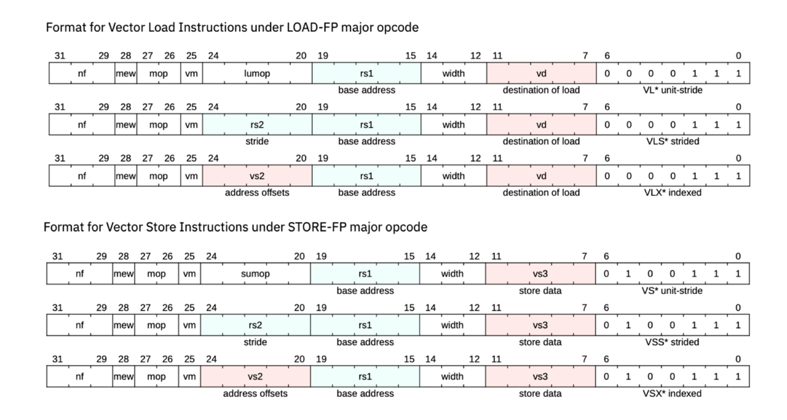

**图 4-1　加载/存储指令编码格式**

向量访存复用 `LOAD-FP` 和 `STORE-FP` 主操作码空间。单位步长格式 `VL*`/`VS*` 通过 `lumop`/`sumop` 表示特殊变体；固定步长格式 `VLS*`/`VSS*` 由 `x[rs2]` 给出元素间的字节步长；索引格式 `VLX*`/`VSX*` 由 `vs2` 提供地址偏移向量。分段访存中，`nf` 编码字段数减 1；`mop` 选择寻址模式，`vm` 控制掩码，`x[rs1]` 提供基地址。加载以 `vd` 为目的，存储以 `vs3` 为数据源。

*改编自《RISC-V Vector Extension Specification, Version 1.0》，RISC-V International，CC BY 4.0。*

### 4.1.2 有效 LMUL

对单位步长和固定步长访存，指令编码给出的数据 EEW 可以不同于 `vtype` 中的 SEW。许多应用先紧凑地加载窄数据，再扩展为较宽格式计算。理解寄存器占用的关键，是有效 LMUL，也就是 `EMUL = (EEW/SEW) × LMUL`。

假设 VLEN=512，配置 SEW=16、LMUL=1，则 VLMAX=32。再设 VL=32、`vstart=0` 且不使用掩码：一条 EEW=32 的加载需要读取 32 个元素，共 1024 位，因此目的 EMUL=2。例如目的写 `v4` 时，实际占用 `v4`～`v5`，起始编号必须按 2 对齐。

同理：

- EEW=8 时，32 个元素只占 256 位，EMUL=1/2；
- EEW=64 时，32 个元素占 2048 位，EMUL=4，例如从 `v4` 开始会占 `v4`～`v7`，起始编号必须能被 4 整除。

这一机制支持混合精度数据流，例如加载 16 位数据，用加宽加法得到 32 位结果，再按 32 位元素存储。硬件根据 EEW、SEW 和当前 LMUL 计算 EMUL，从而确定每个操作数实际占用多少个体系结构向量寄存器。

> **译注：**上面的 EEW/EMUL 示例针对单位步长和固定步长数据操作数。索引访存的数据操作数使用 SEW/LMUL，索引操作数才使用指令编码中的 EEW 及相应 EMUL，不能把二者混用。

### 4.1.3 单位步长操作

单位步长是最简单、通常也是效率最高的访存模式。元素 0 位于 `base`，元素 1 位于 `base+EEW_bytes`，元素 2 位于 `base+2×EEW_bytes`，依此类推。连续地址最有利于充分使用内存带宽。

**仅首元素故障加载（fault-only-first load）。**单位步长加载提供 `vle*ff` 变体，适用于事先不知道安全读取边界的场景。若元素索引 0 发生同步异常，指令正常陷入，`vl` 不因此变为 0；若索引 `i>0` 发生同步异常，则不报告这次异常，而将 `vl` 缩短到 `i`。这里的“首元素”不是第一个活动元素，新的 VL 也不是成功访问次数，详见 3.8.2 节。

字符串扫描是它的典型用途。面对长度未知且可能跨页的字符串，软件可以先请求较大的 VL，再执行仅首元素故障加载；硬件在安全范围内尽可能多取数据，必要时缩短本轮 `vl`。这里处理的是页故障、访问保护等内存异常，而不是“数据值本身出错”。

**整寄存器加载/存储。**操作系统进行上下文切换时，需要在不依赖当前 `vtype` 和 `vl` 的情况下保存、恢复完整 VRF。整寄存器指令可直接传输一个、两个、四个或八个连续向量寄存器；相应编码给出寄存器数量，这类操作也不使用普通的逐元素掩码。

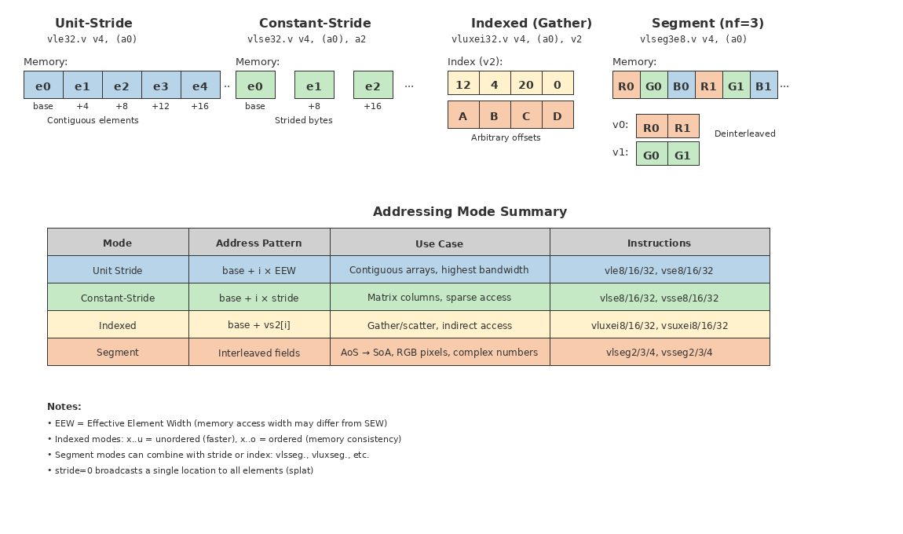

**图 4-2　向量访存的四种寻址模式**

单位步长访问连续元素；固定步长以固定间隔访问；索引模式用偏移向量实现 gather/scatter；分段模式在多个字段与多个向量寄存器之间进行交错或解交错。

### 4.1.4 固定步长操作

固定步长操作以固定字节偏移访问相邻逻辑元素。若元素宽 8 位、stride=2，则元素地址依次为 `base`、`base+2`、`base+4`，即每隔一个字节取一个元素。若元素宽 32 位、stride=8，则相邻元素在内存中相距 8 字节。

步长可以为 0，也可以为负。stride=0 时，所有元素地址都相同，在内存值稳定时可用来广播数据。这里还有一个细节：若编码中 `rs2=x0`，ISA 允许少做一些内存访问；若 `rs2` 编号非零、但寄存器数值恰好为 0，则仍须对各活动元素执行访问。固定步长指令不保证元素间的访问顺序，因此 stride=0 的存储不能保证最后一个逻辑元素成为最终值。

> **译注：**原文把零步长存储概括为“只存最后一个元素”，这里按规范修正。减少访问次数也不是所有零步长指令都能采用的通用优化。

很大或为负的步长可能让一条指令跨越多个物理页和很宽的地址范围。较简单的实现可以限制内部并发访问的范围、分批完成这条指令；软件也可以改用多条标量或向量加载，再通过置换指令整理 VRF 中的数据。

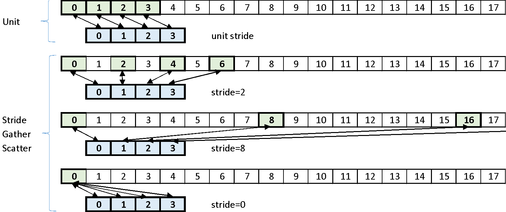

**图 4-3　固定步长访存**

### 4.1.5 索引式 gather/scatter

索引操作使用偏移向量访问任意内存位置。对于 gather 加载 `vluxei`、`vloxei`，`vs2` 保存相对于基地址的字节偏移。例如 `vs2[0]=5`，则目的元素 0 取得 `base+5` 的数据；`vs2[1]=8`，则目的元素 1 取得 `base+8` 的数据。各偏移彼此独立，并不是累计增量，也不要求有序。

scatter 存储 `vsuxei`、`vsoxei` 反向执行同一过程，用相同索引向量决定每个源元素写入哪个内存位置。

助记符中的位宽描述索引，而不是数据。例如 SEW=32、LMUL=1 时，`vluxei16.v v4, (a0), v8` 使用 16 位字节偏移、读取 32 位数据。索引 `v8` 的 EMUL=1/2，数据目的 `v4` 的 EMUL=1。

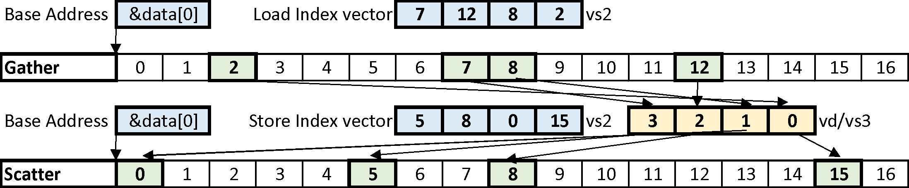

**图 4-4　索引式 gather/scatter 访存**

有序与无序形式对索引操作影响很大。假设 scatter 的元素 0 写缓存行 A，元素 1 写缓存行 B，元素 2 又写缓存行 A：

- 有序 scatter 必须按 A、B、A 的元素顺序产生效果，可能导致缓存行来回切换；
- 无序 scatter 可以先合并或并行处理指向 A 的访问，再处理 B，从而提高效率，但不提供相同的严格元素顺序保证。

索引值可能覆盖很大的地址范围，简单实现可以限制内部并发处理的页数或请求数，再分批推进。若所有目标数据都位于可安全读取的连续区域，可以考虑先单位步长加载，再在寄存器中重排。存储方向更需谨慎：地址空洞、重复索引、访问顺序和额外写入，都可能使“重排后连续存储”不再等价。

### 4.1.6 分段访存

分段操作把内存中交错排列的多个字段加载到连续向量寄存器组，或执行相反的交错存储。字段数记为 `NFIELDS`，指令编码满足 `NFIELDS = nf + 1`。例如 NFIELDS=4、每字段 EMUL=1 时，四个字段分别进入四个目的寄存器；下一个结构的四个字段则进入这些寄存器各自的下一个元素位置。

这种指令很适合 AoS（array of structures，结构体数组）布局。假设 RGB 像素由三个连续字节组成，NFIELDS=3 的分段加载可以把数据拆成三个向量。在 SEW=8、LMUL=1、无掩码的例子中，所有 R 值进入 `v0`，G 值进入 `v1`，B 值进入 `v2`，随后分别处理三个颜色通道。

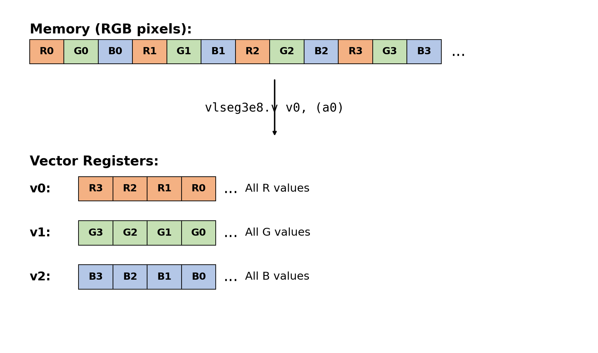

**图 4-5　三字段分段加载：从 AoS 转换为 SoA**

> **译注：**原文和原图把字段数简写为 `nf`，容易与指令编码混淆。RGB 的 NFIELDS=3，对应编码 `nf=2`；四字段的 NFIELDS=4，对应 `nf=3`。原图保留，编码含义以本说明为准。

`vlseg3e8.v` 每组读取 R、G、B 三个 8 位字段，并分别解交错到三个向量寄存器。一条指令替代三条独立固定步长加载，并为硬件统一优化访问提供机会。

分段操作也可以用多条固定步长指令等价表达，但单指令形式既减少指令数，也允许硬件更好地合并内存访问。

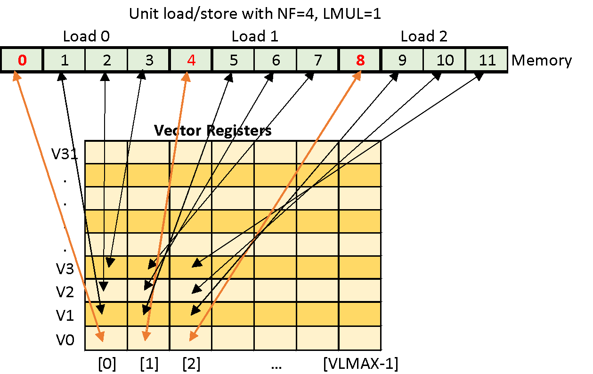

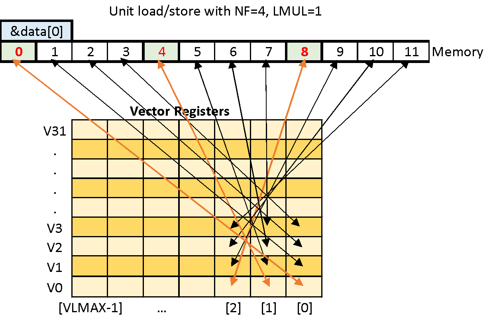

**图 4-6　NF=4 的单位步长分段加载/存储**

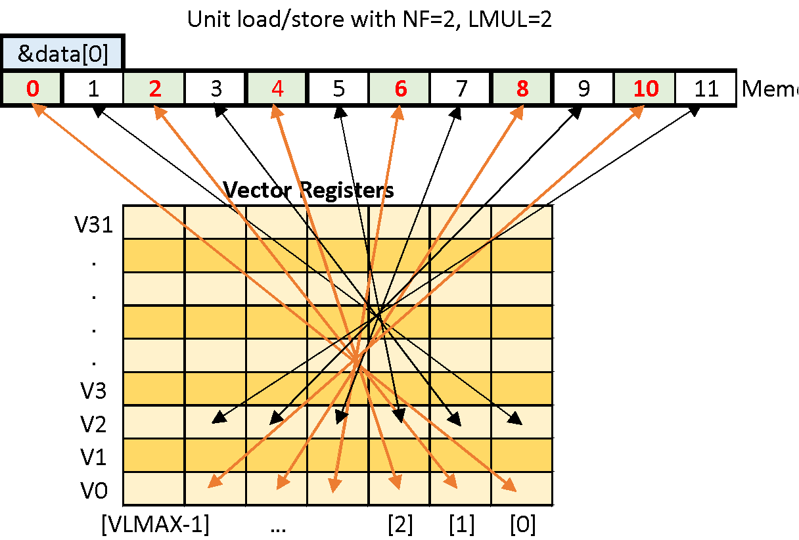

**图 4-7　固定步长分段加载/存储**

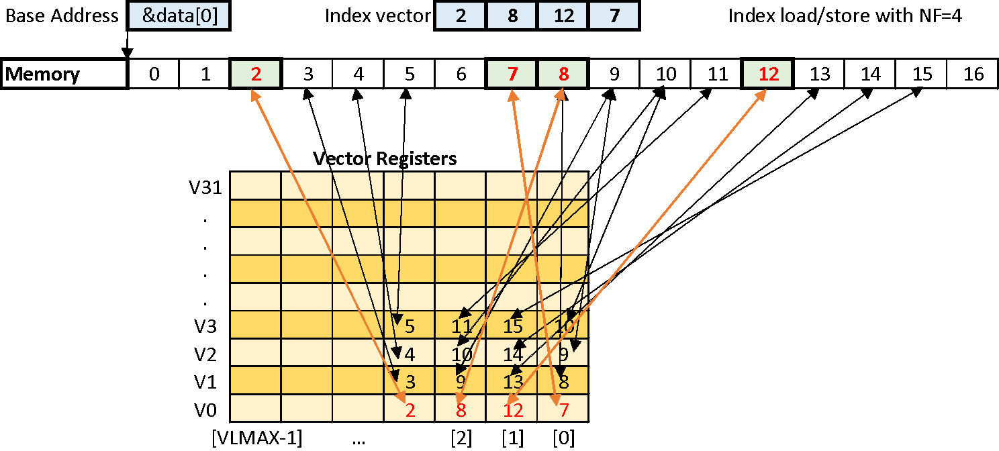

**图 4-8　索引式分段加载/存储**

每个字段的寄存器分组由数据 EMUL 决定。例如 EMUL=2、NFIELDS=4、目的从 `v0` 开始时，四个字段依次占 `v0`～`v1`、`v2`～`v3`、`v4`～`v5`、`v6`～`v7`。每组分别按 EMUL 对齐，不要求首组按整个八寄存器区域对齐。还必须满足 `EMUL × NFIELDS ≤ 8`，且寄存器编号不能越过 `v31`；EMUL<1 时，每个字段仍使用独立寄存器名称。

分段指令中的 VL 表示段数，掩码也按整段生效。有序索引分段访存保证段与段之间的顺序，但同一段内部各字段的访问仍是无序的。不同索引可以指向重叠地址，软件不能忽略相应的顺序语义。

从实现角度看，分段访存结合了固定步长与索引访存的特征，因此也面临跨页范围、地址窗口和存储体冲突等复杂度问题。

### 4.1.7 应用：矩阵乘法

分段加载和索引加载可以配合表达矩阵乘法。例如，把矩阵 B 的若干列装入不同向量寄存器，再通过适当的加载或广播方式准备矩阵 A 的一行；随后执行逐元素乘法，并用归约指令得到点积。实际高性能内核通常还要结合矩阵布局、缓存分块和寄存器复用进一步优化。

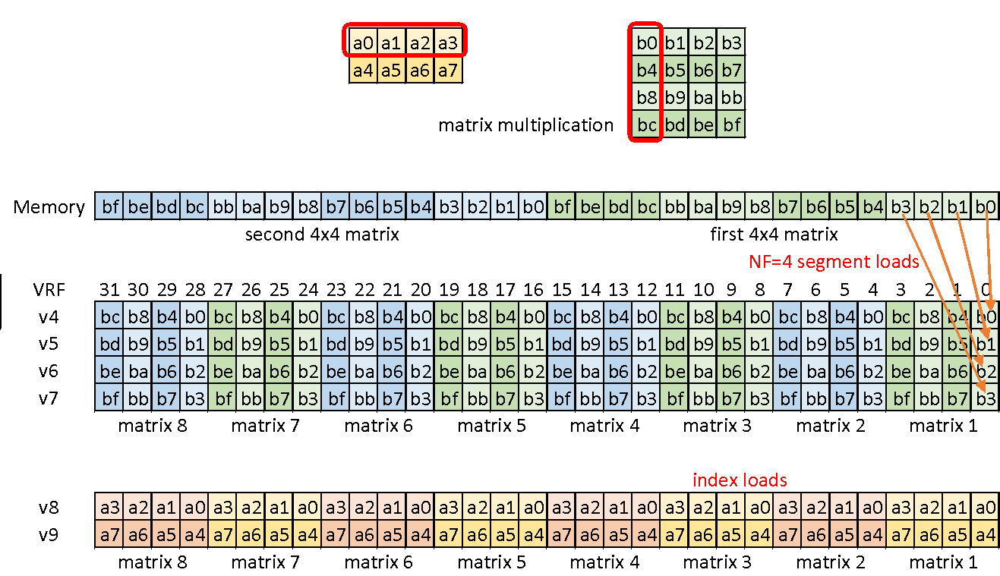

**图 4-9　使用向量操作执行矩阵乘法**

---

## 4.2 计算操作

计算指令对向量元素执行算术、逻辑和比较。整数指令中有向量-向量、向量-标量和向量-立即数形式，但并非每种操作都提供全部形式。浮点指令主要采用向量-向量和向量-标量形式，不直接编码一般浮点立即数。

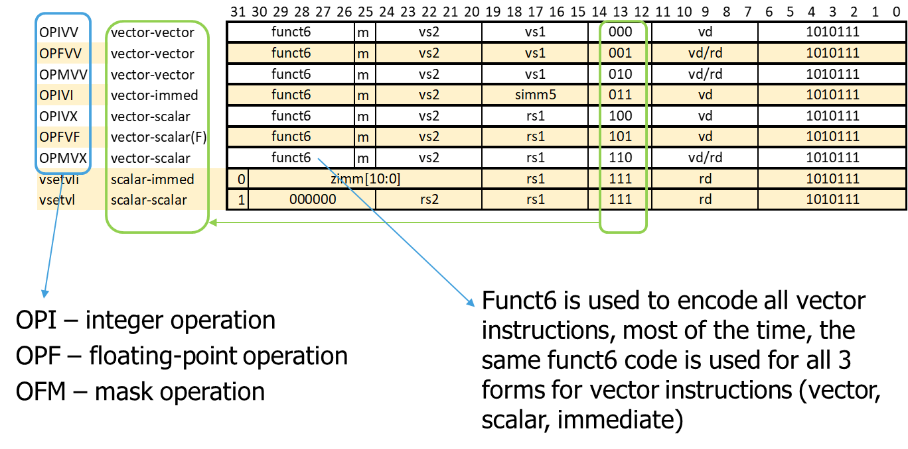

**图 4-10　计算指令分类**

计算指令使用共同的 `OP-V` 主操作码，再由功能字段划分类别。OPI、OPF、OPM 是编码类别，其中 OPM 不只有掩码逻辑，也包含整数乘除、归约等操作。以下是说明操作数关系的通用写法，不是可直接汇编的指令清单。

```text
vop.vv vd, vs2, vs1, vm    // 向量-向量：vd[i]=vs2[i] op vs1[i]
vop.vx vd, vs2, rs1, vm    // 向量-标量：vd[i]=vs2[i] op x[rs1]
vop.vi vd, vs2, imm, vm    // 向量-立即数：vd[i]=vs2[i] op imm
vfop.vv vd, vs2, vs1, vm   // 浮点向量-向量
vfop.vf vd, vs2, rs1, vm   // 浮点向量-标量：标量来自 f[rs1]
```

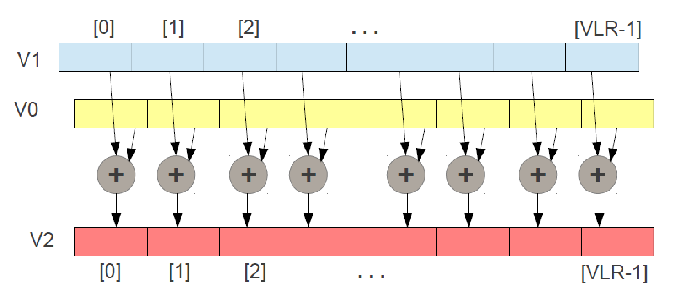

**图 4-11　计算指令编码格式**

### 4.2.1 加宽操作

加宽操作产生位宽为输入两倍的结果，助记符中的 `w` 表示 widening。主要有两种形式：两个单宽源产生双宽结果 `vwop.vv`，以及一个源已经为双宽的混合宽度形式 `vwop.wv`。

```text
vwop.v{v,x} vd, vs2, vs1/rs1   // 2*SEW = 扩展(SEW) op 扩展(SEW)
vwop.w{v,x} vd, vs2, vs1/rs1   // 2*SEW = 2*SEW op 扩展(SEW)
vfwop.v{v,f} vd, vs2, vs1/rs1  // 浮点：2*SEW = SEW op SEW
vfwop.w{v,f} vd, vs2, vs1/rs1  // 浮点：2*SEW = 2*SEW op SEW
```

整数 ALU 加宽与整数乘法的实现有所不同。加、减等 ALU 操作先把两个源符号扩展或零扩展到双宽，再执行双宽运算并写回双宽结果。

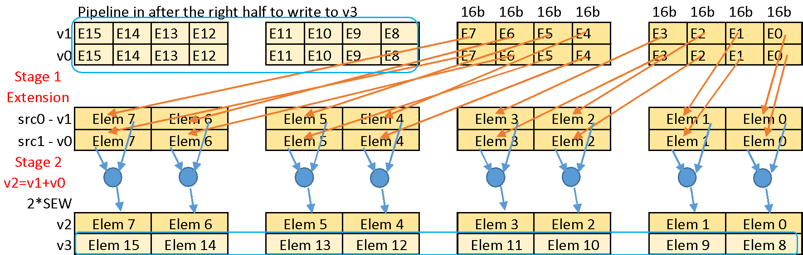

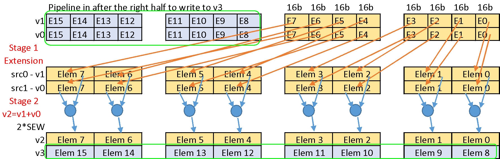

**图 4-12　加宽整数加减法**

整数加宽乘法直接保留完整乘积，例如 16×16 位乘法得到 32 位结果。浮点加宽运算则先把输入提升到较宽格式，再按目标格式的语义完成计算和舍入。

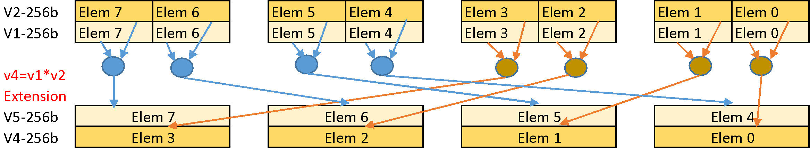

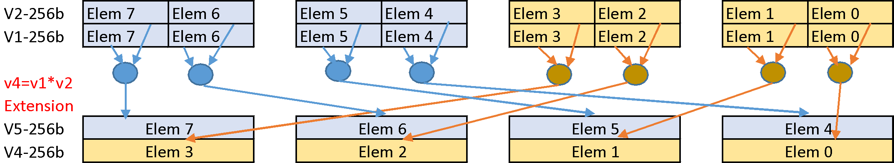

**图 4-13　加宽乘法**

在一种 VLEN 粒度实现中，LMUL=1 的加宽结果占两个连续向量寄存器。处理器可以拆成两个微操作，分别处理源元素的两部分并写入目的寄存器组的相应区域；两个微操作可以顺序执行，也可以流水化。

**纯扩展指令。**`vzext` 和 `vsext` 只做零扩展或符号扩展，提供 `.vf2`、`.vf4`、`.vf8` 三种倍数。目的 EEW=SEW、目的 EMUL=LMUL；源 EEW 和 EMUL 则分别除以该倍数。源位宽必须受支持，源 EMUL 也不能低于实现支持的最小分数 LMUL。

> **译注：**例如 SEW=32 时，`.vf4` 是把 8 位扩展到 32 位，而不是把 32 位扩展到 128 位；`.vf8` 会要求 4 位源元素，RVV 1.0 不支持。原文的扩展倍数说明在此按规范澄清。

### 4.2.2 窄化操作

窄化操作把双宽源缩减为单宽结果，包括逻辑/算术右移以及后文的定点 clip。源操作数占用更宽寄存器组，结果则落入较窄的目的寄存器组。

典型流程是：加载两组 16 位数据，执行加宽加法得到 32 位结果，再用窄化右移把结果压回 16 位。这在定点 DSP 中很常见。

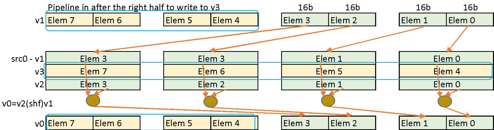

**图 4-14　窄化移位操作**

在硬件中，窄化可以按数据块逐步完成：读取双宽源的一部分，完成移位、舍入或截断后写入较窄的目的区域，再继续处理后续数据。

### 4.2.3 整数算术

标准整数操作包括：加、减、AND/OR/XOR，逻辑左移、逻辑右移、算术右移，有符号和无符号的等于、不等、小于、小于等于、大于、大于等于比较，以及 min/max、乘法、除法和余数。

完整类别包括：

- 向量整数加、减、反向减，包括双宽形式；
- 向量整数扩展；
- 带进位加与带借位减；
- 向量位逻辑；
- 向量移位，包括窄化移位；
- 向量整数比较，向目的掩码写入 1/0；
- 有符号/无符号 min/max；
- 整数乘法，包括双宽形式；
- 整数除法与余数；
- 乘加/乘减和乘累加，包括双宽形式；
- merge 与 move。

**进位与借位。**多精度算术需要处理进位和借位。RVV 分别提供产生普通算术结果和产生进位输出的指令，每条只写自己的目的操作数。它们按元素计算，不会自动把元素 i 的进位串到元素 i+1；多字整数各部分之间的进位传递仍由软件组织。

`vadc` 对 `vs2`、`vs1` 和 `v0` 中对应的进位输入求和；带进位输入的 `vmadc` 对相同输入产生进位输出，并写入目的掩码寄存器。软件安排二者顺序时，必须保留仍需使用的数据和进位输入，不能让前一条先覆盖后一条所需的源。

> **译注：**原文把这种跨指令的数据保护写成了硬件非法重叠检查，还规定必须先执行 `vadc`。这并不准确：两条指令可按依赖关系安排顺序；合法指令覆盖了后续计算所需的数据，属于软件逻辑错误，硬件不会据此自动报非法指令。单条指令自身的寄存器重叠限制则另按规范判断。

### 4.2.4 乘累加

乘累加有两类主要操作数排列：

- 累加形式 `vmacc`：`vd = vd + (vs1 × vs2)`；
- 覆盖式乘加 `vmadd`：`vd = (vd × vs1) + vs2`，其中旧 `vd` 是乘数之一。

`vnmsac`、`vnmsub` 等变体改变乘积或加减号；整数和浮点均有相应形式。

从体系结构看，`vmacc` 需要读取旧 `vd`、`vs1` 和 `vs2`，因此有三个逻辑源。某些微架构可以通过旁路或局部累加路径复用刚产生的累加结果，减少连续相关操作反复访问 VRF 的压力；但跨指令保留结果的方式必须维持 ISA 可见的数据相关与异常语义。

### 4.2.5 Merge 与 Move

`vmerge` 根据掩码位在两个数据源之间选择：掩码为 0 时取 `vs2`，为 1 时取另一个向量、标量或立即数源。由于掩码本身承担选择控制，merge 使用特定的 `vm=0` 编码形式。

同一编码空间在 `vm=1` 且 `vs2=v0` 时用于 `vmv`，把源复制到 VL 和 `vstart` 指定的目的范围；其他 `vs2` 编码保留。源为标量寄存器或立即数时，move 会把该值广播到各目的元素，即 splat。

### 4.2.6 定点算术

定点操作面向不使用浮点硬件、但需要小数运算的 DSP 应用。

- 饱和加减 `vsadd`、`vssub` 把溢出结果钳位到可表示范围，而不是模回绕；
- 平均加减 `vaadd`、`vasub` 计算带舍入的 `(a+b)/2` 或 `(a-b)/2`，避免中间和溢出，适合滤波器。

**带舍入的分数乘法。**`vsmul` 执行有符号分数乘法：两个 Q 格式数相乘，右移 `SEW-1` 位，按照 `vxrm` 舍入模式舍入，并对结果饱和。例如两个 Q15 相乘得到 Q15 结果。

**缩放移位与 clip。**`vnclip`、`vnclipu` 把双宽源右移指定距离，按 `vxrm` 舍入，再饱和到单宽目的范围：

- 有符号 `vnclip` 饱和到 `[-2^(SEW-1), 2^(SEW-1)-1]`；
- 无符号 `vnclipu` 饱和到 `[0, 2^SEW-1]`。

它把原本需要多条指令的窄化移位、舍入和饱和合并为一次操作。

### 4.2.7 浮点算术

浮点操作与整数类别大体对应，包括加、减、乘、除、平方根、min/max 和比较。融合乘加指令 `vfmacc`、`vfnmacc`、`vfmsac`、`vfnmsac`、`vfmadd`、`vfnmadd`、`vfmsub`、`vfnmsub` 只在最终结果处进行一次舍入，因此比拆分的乘法和加法具有更好的数值精度。

浮点指令主要包括：

- 浮点加、减、反向减及加宽形式；
- 浮点乘法及加宽形式；
- 除法与反向除法；
- 乘加/乘减和乘累加及加宽形式；
- 平方根、倒数平方根估计和倒数估计；
- 浮点比较；
- min/max；
- merge 与 move；
- 符号注入；
- 浮点分类；
- 浮点与整数之间、不同浮点宽度之间的转换，包括加宽和窄化。

### 4.2.8 归约操作

归约把源向量中的活动元素与初始值 `vs1[0]` 合并，结果写入 `vd[0]`。这里的“标量结果”仍位于向量寄存器的元素 0，并非直接写入整数或浮点标量寄存器。整数归约包括：

- 求和 `vredsum`；
- 有符号/无符号 min/max：`vredmin`、`vredmax`、`vredminu`、`vredmaxu`；
- 逻辑归约：`vredand`、`vredor`、`vredxor`。

浮点归约包括有序/无序求和 `vfredosum`、`vfredusum` 以及 min/max。

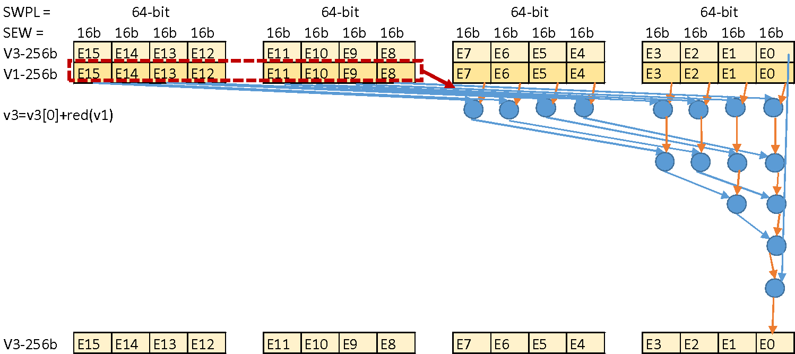

**图 4-15　归约操作数据通路**

实现可以复用普通功能单元，分多轮完成树形归约。这样做面积较省，却会让同一功能单元连续多个周期被归约占用；若目标应用高度依赖归约，也可以加入专用或流水化归约硬件来提高吞吐率。

无序求和可以采用树形算法：先将元素两两相加，每层把待归约数量减半，直到剩下一个结果。仅考虑 16 个输入的树，深度为 `log2(16)=4`。若每级加法延迟为 1 周期，理想依赖路径为 4 周期；若为 3 周期，则为 12 周期。这里还没有计入初始值 `vs1[0]` 的合并、数据搬运和资源复用开销，不能直接当作 RVV 归约指令的总延迟。

有序浮点求和则从 `vs1[0]` 开始，按元素顺序累加。16 个活动元素意味着 16 次依赖相加，在每次加法延迟为 3 周期的简单实现中，对应 48 周期的依赖链。VL=0 时，归约连 `vd[0]` 也不更新；VL>0 但所有源元素被屏蔽时，则按具体归约指令对初始值的规定处理。

> **译注：**原文的树深度例子省略了归约初始值，这里补上计数边界。有序与无序描述的是允许的数值计算顺序，不只是调度策略；浮点无序归约也必须遵守规范规定的运算树和舍入约束。

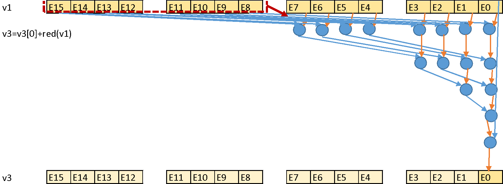

**图 4-16　归约求和实现**

按点积方式实现矩阵乘法时，归约可以把一行与一列的逐元素乘积汇总为 C 的一个元素。采用外积式分块的实现则可以让向量各元素分别累加不同的 C 元素，不一定需要显式横向归约。

---

## 4.3 掩码操作

掩码操作处理向量寄存器中逐元素的一位掩码值。无论当前 SEW 是多少，每个逻辑元素都对应一个掩码位。`vmand`、`vmnand`、`vmor`、`vmnor`、`vmxor`、`vmxnor` 等逻辑指令组合两个掩码向量。掩码数据按位紧凑存储，其寄存器占用规则不同于普通数据向量。

主要掩码操作包括：

- AND、NAND、AND-NOT、OR、NOR、OR-NOT、XOR、XNOR；
- 掩码置位计数 `vcpop`；
- 查找第一个置位 bit 的 `vfirst`；
- 第一个置位之前置位 `vmsbf.m`；
- 置位到并包含第一个置位 `vmsif.m`；
- 只保留第一个置位 `vmsof.m`；
- 向量 iota 前缀计数；
- 向量元素索引生成。

逻辑指令的特殊编码可以构成常用操作：

```text
vmmv.m  = vmand.mm vd, vs, vs   // 复制掩码
vmclr.m = vmxor.mm vd, vd, vd   // 清零掩码
vmset.m = vmxnor.mm vd, vd, vd  // 全部置位
vmnot.m = vmnand.mm vd, vs, vs  // 按位取反
```

**掩码查询。**`vcpop` 统计参与操作的置位数量；`vfirst` 返回第一个参与操作的 1 的索引，若不存在则返回 -1；`vmsbf`、`vmsif`、`vmsof` 根据首个 1 的位置生成掩码。`viota` 计算不包含当前位置的前缀计数，可用于生成压缩后的目的索引。例如在无掩码、VL=4 时，输入 `[1,0,1,1]` 得到 `[0,1,1,2]`。

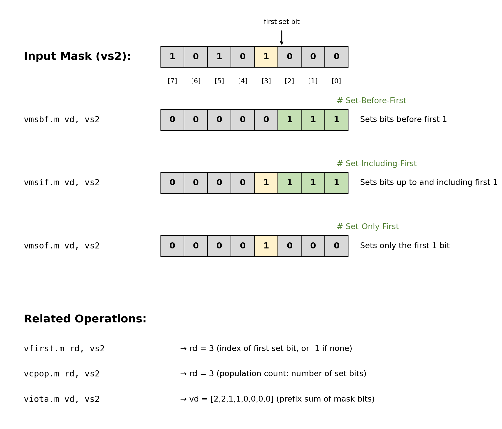

**图 4-17　`vmsbf`、`vmsif`、`vmsof` 与 `viota`**

假设输入掩码 `vs2` 的第一个 1 位于索引 3：`vmsbf.m` 设置索引 3 之前的所有位，`vmsif.m` 设置索引 0～3，`vmsof.m` 只设置索引 3。这些操作适合循环终止检测和前缀计算。

---

## 4.4 置换操作

置换操作在向量寄存器内部或寄存器之间重排元素，包括标量元素提取/插入、slide、gather 和 compress。

### 4.4.1 标量移动

`vmv.x.s` 和 `vmv.s.x` 在向量寄存器元素 0 与整数标量寄存器之间搬运数据；`vfmv.f.s` 和 `vfmv.s.f` 处理浮点标量传输。它们构成标量与向量执行的接口，可用于提取归约结果或插入标量值。

### 4.4.2 Slide 操作

slide 在向量内部按索引方向移动元素：

- `vslideup.vi/vx` 把元素移向更高索引。例如 offset=3 时，源元素 0 进入目的位置 3，源元素 1 进入位置 4；索引低于 offset 的目的元素不由该操作写入，保持原值；
- `vslidedown.vi/vx` 把元素移向更低索引。例如 offset=3 时，源元素 3 进入目的位置 0，源元素 4 进入位置 1；只有源索引不小于 VLMAX 时才读取为 0。源索引若位于当前 VL 之外、但仍小于 VLMAX，读取的仍是对应寄存器元素，因此不能笼统地把当前活动范围之外都视为 0。

```text
vslide1up.vx vd, vs2, rs1, vm    // vd[0]=x[rs1], vd[i+1]=vs2[i]
vslideup.vx vd, vs2, rs1, vm     // vd[i+x[rs1]]=vs2[i]
vslideup.vi vd, vs2, uimm, vm    // vd[i+uimm]=vs2[i]
vslide1down.vx vd, vs2, rs1, vm  // vd[i]=vs2[i+1], vd[vl-1]=x[rs1]
vslidedown.vx vd, vs2, rs1, vm   // vd[i]=vs2[i+x[rs1]]
vslidedown.vi vd, vs2, uimm, vm  // vd[i]=vs2[i+uimm]
```

以上是忽略掩码等边界条件的索引关系。`vslide1up` 向高索引移动一位，并用 `x[rs1]` 填入目的元素 0；`vslide1down` 向低索引移动一位，把标量填入目的位置 `VL-1`。这些写入仍受 `vstart` 和掩码约束，并不是无条件修改整个寄存器。

> **译注：**原文对普通 slide 的空缺位置作了简化。`vslideup` 不修改起始偏移之前的主体元素；`vslidedown` 则以 VLMAX 而非 VL 判断源索引是否越界，不能把所有“高端空位”都理解为补零。

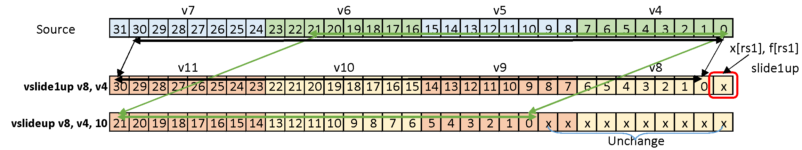

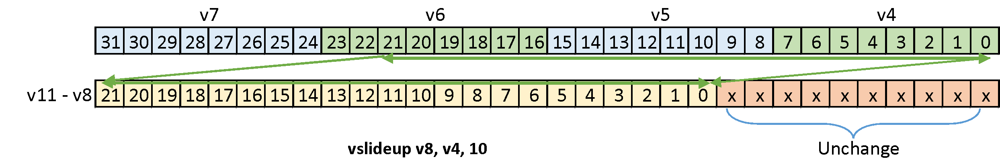

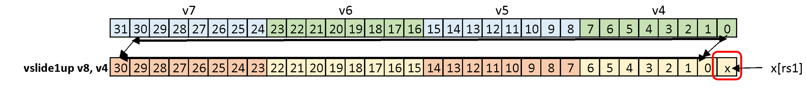

**图 4-18　`vslideup` 与 `vslide1up`**

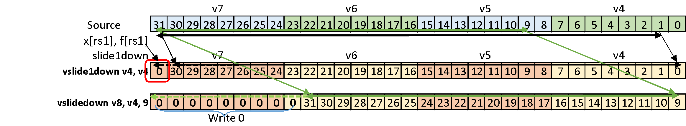

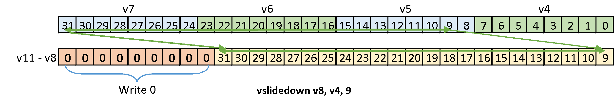

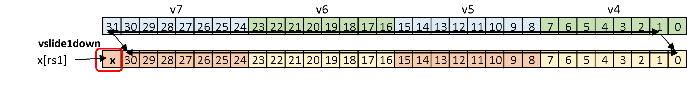

**图 4-19　`vslidedown` 与 `vslide1down`**

### 4.4.3 Gather 操作

`vrgather` 根据索引向量在寄存器中重排元素。`vs1` 为每个目的位置指定要从 `vs2` 读取的源元素：例如 `vs1[0]=5` 时，`vd[0]=vs2[5]`。索引既不要求唯一，也不要求有序。

```text
vrgather.vv vd, vs2, vs1, vm      // vd[i]=vs2[vs1[i]]
vrgatherei16.vv vd, vs2, vs1, vm  // 索引元素固定为 16 位
vrgather.vx vd, vs2, rs1, vm      // vd[i]=vs2[x[rs1]]
vrgather.vi vd, vs2, uimm, vm     // vd[i]=vs2[uimm]
```

`vrgather.vx` 和 `vrgather.vi` 把同一个源元素广播到全部活动目的元素。

所有形式都以 VLMAX 判断源索引边界：索引小于 VLMAX 时可以读取对应源元素，即使其索引不小于当前 VL；索引不小于 VLMAX 时结果为 0。目的更新仍受 VL、`vstart` 和掩码限制。

某些算法可以用“单位步长加载 + `vrgather`”替代索引加载。前提是需要的数据能装入可索引的源寄存器范围，额外读取的连续区域也安全，且访问语义等价。在这些条件下，规则访存加寄存器重排可能更高效。

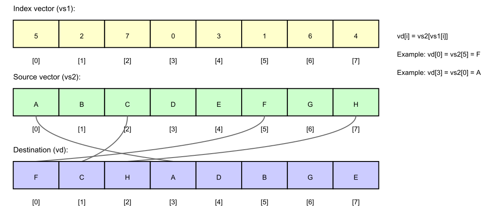

**图 4-20　`vrgather.vv`**

例如索引 `vs1=[3,0,2,1,7,4,6,5]`、源 `vs2=[A,B,C,D,E,F,G,H]`，结果为 `vd=[D,A,C,B,H,E,G,F]`。索引可以重复以复制元素，也可以省略某些索引以丢弃元素。

### 4.4.4 Compress

`vcompress` 把掩码选中的源元素紧凑排列到目的向量低端。掩码位为 1 时复制对应源元素到下一个可用目的位置，为 0 时跳过。例如掩码 `[1,0,0,1,1,0,1,0]`、源 `[A,B,C,D,E,F,G,H]`，低端有效结果为 `[A,D,E,G]`，其余位置按尾部策略处理。

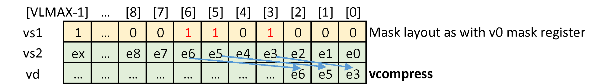

**图 4-21　`vcompress`**

压缩的语义很直观，硬件实现却不轻松。若一次涉及 512 个元素，就要对全部掩码位计算前缀计数，为每个保留元素确定新的目的位置；数据路由网络还必须应对各种疏密程度。

### 4.4.5 整寄存器移动

`vmv<nr>r.v` 复制一个、两个、四个或八个连续的完整寄存器，源、目的起始编号须按寄存器数量对齐。它不按当前 VL 限定搬运长度，也不按当前 LMUL 决定分组大小，常用于调整寄存器分配或满足后续操作的对齐要求。

> **译注：**原文称其完全忽略 `vtype`，不够准确。该指令按 EEW=SEW、EMUL=寄存器数量解释操作，有效长度 `evl = 寄存器数量 × VLEN / SEW`，并按 `vstart` 与 evl 判断执行范围；`vstart=0` 时搬运完整寄存器内容。

---

## 4.5 小结

RISC-V 向量扩展提供了覆盖访存、计算、掩码和数据置换的完整指令体系。访存支持单位步长、固定步长、索引和分段模式；计算覆盖整数、浮点和定点，并提供加宽与窄化变体；置换操作则为复杂算法提供所需的数据重排能力。

从这些指令可以看到几项设计原则：

1. 普通算术指令尽量采用单目的操作数，便于控制写回复杂度；分段加载、配置指令等不能简单归入这一概括；
2. EMUL 机制支持混合精度，而无需为每一种宽度组合建立完全独立的指令体系；
3. 访存和浮点归约提供有序/无序形式，让软件在严格语义与性能之间选择；
4. 掩码不仅能控制其他指令，也有自己的逻辑运算和查询指令。

第 5 章将以矩阵乘法和乘累加流水线为例，讨论这些指令如何配合，以及数据布局、访存和调度如何影响性能。


---

## 支持原作与反馈

*译者附记*

**如果这篇内容对你有帮助，欢迎访问 [Simplex Micro 官网](https://www.simplexmicro.com)，并向原作者分享你的阅读反馈。** 这是作者在授权交流中特别提出的期待，也是支持这份教程继续完善的一种方式。

反馈不必很长：哪一章最有帮助、哪个概念仍不清楚、希望增加哪些算例，都值得告诉作者。作者不阅读中文，建议使用简短英文，并注明来自 *RISC-V Vector Primer* 中文译本。

中文翻译的用词、错漏或排版问题，请在译文评论区或中文译稿仓库反馈，由译者跟进；不要将译文中的问题视为原作者已经审定的内容。
