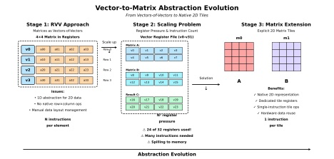
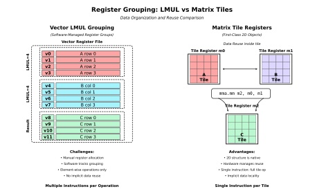
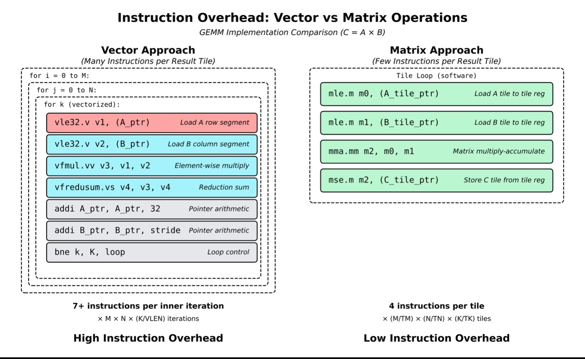
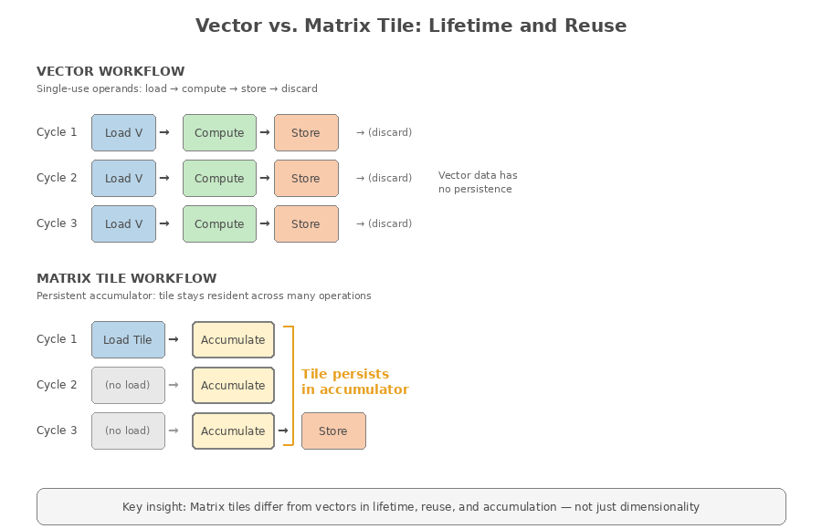

# 第 6 章：从向量到矩阵：RISC-V 矩阵扩展的架构思路

> 本文是 *RISC-V Vector Primer* 的非官方中文译文，经原作者邮件许可，用于非商业技术教育。
>
> 原作者：Thang Minh Tran、Paul Miller；编辑：Jonah McLeod；出版方：Simplex Micro。中文翻译：Ch'in。
>
> [英文原作](https://github.com/simplex-micro/riscv-vector-primer) · 依据版本：`fc66957a6458842beeabe9d85065ff334ccbd333`（2026-07-25）。授权摘要及译注原则见[翻译说明](TRANSLATION-NOTICE.md)。原作者未审校中文译文。
>
> **支持原作：**作者特别欢迎中文读者访问 [Simplex Micro 官网](https://www.simplexmicro.com)，并分享阅读反馈与改进建议。文末附有反馈说明。

---

## 1. RVV 解决了可移植性问题

RISC-V 向量扩展试图回答并行计算领域一个由来已久的问题：怎样描述数据并行程序，才能让同一份软件在硬件能力差异很大的处理器上继续正确运行？

RVV 不把程序绑定到某个固定向量宽度。同一份向量长度无关的二进制代码，可以在 VLEN 和微架构不同、但支持所需扩展的处理器上正确执行。软件通过 VL、SEW 和 LMUL 选择每轮处理的元素范围及组织方式，无须为每种硬件宽度重新编译。已有软件因而能用得更久，硬件设计者也有空间调整实现。

这解决了定宽 SIMD 的一个主要局限：循环结构不再直接依赖某个固定指令宽度，数据并行程序更容易跨硬件代际复用。

更重要的是，RVV 并不只面向某一种应用。除了密集数值内核，它也提供掩码、不同元素类型和灵活访存等机制，用来处理带有条件选择、混合数据类型或大量边界情况的循环。它是一套通用向量架构，而不是只服务于某个算法的专用加速器接口。

矩阵乘累加等稠密线性代数内核，同样可以用向量加载、算术、归约和分段处理来实现。但当计算越来越密集，用一系列一维向量操作组织二维矩阵计算所需的指令和数据管理，也逐渐成为值得关注的开销。

**图 6-1　从向量寄存器中的矩阵分片到矩阵块寄存器**

使用 RVV 时，软件把矩阵组织为若干向量片段，并管理布局与寄存器分配；图中的矩阵方案则直接提供二维矩阵块（tile）及整块操作，以减少逐片处理的指令开销。

图中分为三个阶段：

1. RVV 把一个 4×4 矩阵分布到 `v0`～`v3`，布局由软件维护，指令本身并不直接表达行与列之间的二维关系；
2. 问题规模扩大后，同时保存 A、B、C 的数据可能占用 32 个向量寄存器中的 24 个，造成较大寄存器压力，甚至需要把数据溢出到内存；
3. 图中矩阵方案使用 `m0`、`m1` 等矩阵块寄存器保存二维数据，通过整块计算和更深的数据复用，把逐元素或逐向量片的长指令序列压缩为少量矩阵块操作。

> **译注：**本章沿用原作者“矩阵块寄存器 + 计算阵列”的设计视角，不是在介绍已经定稿的统一 RISC-V 矩阵规范。图中的寄存器名称、数量和布局都是示例；“占用 24 个寄存器”也不是任意矩阵乘法的固定需求。

---

## 2. 矩阵负载揭示了向量表达的代价

RVV 完全可以完成矩阵计算，问题在于需要付出多少代价。二维矩阵被拆成一维向量片段后，软件要安排加载、计算、累加和循环推进。计算量越大，这些组织工作对指令供给和寄存器容量的压力就越值得分析。这不是 RVV“失败了”，而是通用向量与专用矩阵指令的取舍不同。

**图 6-2　LMUL 寄存器组与矩阵块的比较**

LMUL 可以扩大单个向量操作数，却不会给它增加行、列维度的语义。矩阵块寄存器则直接描述二维数据，使一条指令能够启动块级计算，并让硬件在内部安排一部分重复运算和数据复用。

这种差别会反映到动态指令数上。采用点积式向量化时，一个矩阵块需要拆成多个片段，分别加载、相乘和归约；采用外积式分块时，可以省去显式归约，但仍要用多条向量指令更新输出块。矩阵指令则可以把更多内层工作封装成一次操作。

**图 6-3　向量与矩阵操作的指令开销**

图左用一个简化的点积循环说明指令开销：每轮包含加载 A、加载 B、乘法、归约、两次指针更新和分支，共 7 条以上指令。若 M=N=K=256，每轮处理 VL=32 个元素，则内层循环共执行 `256×256×(256/32)=524,288` 轮；按每轮 7 条计，约为 367 万条指令。

图右使用 16×16 矩阵块，TM=TN=TK=16。沿三个维度分块，共有 `(256/16)³=4,096` 次块乘累加更新。原文按每次更新 4 条指令估算，得到 16,384 条，想强调的是块级指令对前端开销的摊薄作用。

> **译注：**4,096 是沿 K 分块后的更新次数，不是输出块数量；输出块只有 `(256/16)²=256` 个，每个要累加 16 次。C 块若全程驻留，通常不必每次更新都存回。原文“每个输出块只需四条指令”和“减少 200 多倍”依赖过度简化的计数模型，不能据此推导实际加速比，也不能代表优化后的 RVV GEMM。

> **图中代码说明：**原图中的 `VLEN=32` 实际指每轮 32 个元素，应理解为 VL；`bne k, k, loop` 比较同一寄存器，不会形成循环；处理 32 个 FP32 元素时，连续地址应推进 128 字节，而不是图中的固定 32 字节。B 的列能否用连续加载取得，也取决于其是否已经转置或打包。因此该图只用于理解指令类别，不能直接照抄为程序。

这些开销并非 RVV 独有。矩阵计算通常具有大量数据复用机会和规则的长循环；向量实现若没有做好分块和复用，就容易反复搬运同一批数据，增加指令数和寄存器压力。专用矩阵指令希望在这些场景中进一步提高效率。

### 2.1 从矩阵块到二维计算阵列

本章讨论的方案用矩阵块寄存器保存数据，并由乘累加处理单元（PE）阵列执行计算。每个 PE 将 A、B 的相应元素相乘，再累加到局部部分和；阵列通过协调数据传递和累加，完成块乘积。

> **译注：**软件可见的 tile 形状与物理 PE 阵列形状不是同一个概念。较大的 tile 可以分多拍映射到较小阵列，也可以通过增大阵列提高并行度。物理互连固定，不代表矩阵 ISA 只能暴露固定形状；可查询、可配置或可伸缩的 tile 都是可能的设计选择。

这种数据流与典型的向量流水执行方式有所不同：

- 在向量单元中，元素通常沿通道流动，相关指令按元素或元素组逐步衔接；
- 在矩阵阵列中，A、B 操作数可以按选定的数据流在二维阵列中传播或驻留，输出部分和则常常保存在 PE 或本地累加器中，直到当前输出块完成。

这种局部存储与空间复用，是矩阵执行获得高能效的重要来源。

矩阵阵列会根据数据流选择让某些数据长期留在本地。最常见的例子是输出驻留（output-stationary）：C 的部分和跨越 K 维的多轮 MAC 持续驻留，而 A、B 数据流经阵列；在操作数驻留（operand-stationary）数据流中，也可以让 A 或 B 的一部分保持不动，反复与另一操作数配合。这样，加载和指令开销就能被大量计算摊薄。

> **译注：**不能把这种差别理解为“向量数据只能用一次，矩阵数据才可以长期驻留”。RVV 同样可以让 C 的部分和跨整个 K 循环留在向量寄存器中，第 5 章的代码就是例子。复用机会来自矩阵运算本身；矩阵指令、局部存储和 PE 数据流的优势，是用更少的显式指令、更合适的数据路径实现这种复用。

**图 6-4　向量与矩阵块的生命周期和复用**

图中对比的是两种示例调度：左侧的向量写法反复加载、计算、存储，右侧的矩阵写法让累加块跨多轮计算驻留。原图中的“single-use”和“no persistence”不适用于所有向量实现，不能用来定义向量寄存器的生命周期。

矩阵乘法可以自然拆成分块循环：

- A 块覆盖 M、K 两个维度，尺寸记为 TM×TK；
- B 块覆盖 K、N 两个维度，尺寸记为 TK×TN；
- C 块覆盖 M、N 两个维度，尺寸为 TM×TN，并沿 K 维不断累加。

一条块乘累加指令更新一个 C 块，因此块形状会影响：

- 软件和编译器采用的分块策略；
- 每次加载能够获得多少数据复用；
- 计算量与内存流量的比例；
- 每个输出元素所需指令数。

矩阵块太小，指令和搬运开销不容易摊薄；矩阵块变大，通常需要更多存储，也可能增加调度复杂度。若同时扩大物理阵列，还会增加 PE、互连、面积和时序成本；若阵列不变，则需要更多执行拍次。因此，不能仅凭 tile 大小推断峰值算力，而要同时考察阵列、存储和带宽。

矩阵块寄存器文件及本地存储的容量，还限制了多少 A/B 数据和 C 部分和能够同时驻留。究竟保留哪一类数据、保留多久，需要结合阵列组织、存储容量和软件调度决定，并非仅靠“使用矩阵指令”就自动获得充分复用。

在这种设计中，矩阵扩展可以与向量架构分工协作：

- 标量核负责循环、分支和指针更新，RVV 负责数据整理、布局转换及适合向量化的不规则计算；
- 矩阵单元加速规则、复用率高的稠密内层循环。

作者倾向于由具体实现选择矩阵块形状和数量，在面积、功耗与性能之间权衡，同时保留 RVV 的向量长度无关编程能力。固定形状是其中一种选择，并非矩阵 ISA 的必然限制。

矩阵扩展希望提供的，正是这样的块级操作：让指令能直接表达一批矩阵计算，同时与通用向量操作配合。

### 2.2 矩阵块加速架构中的软件职责

矩阵扩展为二维计算引入矩阵块级抽象，但软件仍要组织整个矩阵内核。矩阵块执行并不会消除向量操作，而是重新划分软硬件之间的职责：

- 标量指令管理外层循环和指针，RVV 执行数据整理、布局转换等向量工作；
- 矩阵指令加速复用率最高的稠密内层循环。

软件需要决定：

- 如何把矩阵划分为多个块；
- 以什么顺序调度这些块；
- 如何把数据送入和移出矩阵块寄存器文件；
- 如何选择与实现参数相匹配的分块尺寸；
- 如何安排内存布局以最大化局部性；
- 如何安排矩阵块的加载和存储，使计算阵列持续获得操作数。

编译器和数学库需要理解矩阵块形状、寄存器文件容量和硬件提供的数据复用方式，就像面向 RVV 优化时需要理解 VL、LMUL 和目标微架构一样。

若矩阵实现采用固定或有限可配置的块形状，软件就按这些参数选择循环边界和分块尺寸。RVV 则通过 `vsetvl*`，根据剩余元素数、`vtype` 和实现容量取得每轮 VL。无论采用哪种模型，要获得最佳性能，通常都需要了解目标机器的存储层次和计算资源。

> **译注：**原文把 RVV 的适配机制写成“运行时由硬件选择 VLEN”。实际动态选择的是 VL，VLEN 是每个 hart 固定的实现参数。此外，普通循环控制和指针更新主要由标量指令完成，不能统称为 RVV 的职责。

软件还要协调向量单元与矩阵单元之间的数据搬运：用 RVV 加载、转置或打包数据，交给矩阵指令完成密集计算，再用标量或向量代码处理结果、边界及不足整块的区域。两类单元如何传递数据，要看具体矩阵方案定义的接口。

矩阵单元因此更适合作为补充：它加速规则的二维内层计算，RVV 和标量核则处理整个程序中更灵活、更零散的工作。

---

## 3. 用向量指令看清矩阵计算的瓶颈

RVV 的一个优点，是把计算步骤明确写在指令流中。分析矩阵内核时，可以沿着加载、运算、累加和写回逐步查看，判断瓶颈来自指令供给、数据搬运，还是计算依赖。

按矩阵规模，可以粗略分为：

- **小矩阵：**所需数据能够放入可用的向量寄存器容量，可以较高效地加载、计算并写回；
- **中等矩阵：**例如矩阵 A 的一个维度能够保留在 VRF 中，内核可以持续加载 B，并把结果累加到 C。VLEN=512、SEW=32 时，单个向量寄存器可容纳 16 个元素；若 LMUL=8，一个寄存器组可容纳 128 个元素。SEW=16 时，相同寄存器组可容纳 256 个元素；
- **大矩阵：**全部数据无法同时留在 VRF 中，每轮需要按矩阵块或向量片段加载数据，并跨多轮累加部分结果。

矩阵密集内核通常具有较高算术强度，并由较长、深度流水化的向量指令序列组成。一次停顿可能影响后续多个周期，降低宽流水线的利用率。若指令和内存延迟较为稳定，软件与硬件就更容易重叠彼此独立的操作，并把不可避免的延迟摊到大量元素上；若延迟频繁波动，数据供给就可能被打断，即使功能单元的峰值很高，持续吞吐率仍会下降。

VL、访存指令和分段循环让这些工作量更容易分析；实际停顿出在哪里，仍需结合具体微架构和性能测量。稠密线性代数的高吞吐要求，也正是在这里转化为对指令供给、数据复用和流水线稳定性的要求。

---

## 4. 社区的回应：专用化，而不是替代

理解 RISC-V 矩阵扩展，可以从这种分工出发：保留通用向量能力，再增加面向稠密矩阵计算的专用指令和硬件。

- RVV 仍是 RISC-V 生态中的通用数据并行模型，适合数据整理、带条件的数据并行代码和混合负载；
- 矩阵扩展专门面向稠密、规则的内层循环，其中计算天然为二维结构，指令开销和数据复用决定性能。

这也符合现代处理器的一种发展趋势：不同类型的工作交给互补的执行单元，而不是要求同一套指令高效处理所有问题。矩阵扩展的目标，是让密集矩阵计算得到更直接的表达，同时与已有的软件和执行资源协作。

---

## 5. 矩阵扩展的状态与范围

本译稿依据的英文版本（源提交日期 2026-07-25）将 RISC-V 矩阵扩展描述为仍在讨论和定义中、尚未批准。工具链和硬件原型展示了若干方向，但性能目标、实现复杂度和长期兼容性仍需权衡。本节保留的是该版本的背景，不代表已核实译稿修订时的最新标准状态。

本章的矩阵方案通过专用矩阵寄存器文件直接表达二维块。RVV 操作的是一维元素序列，矩阵指令则保留行列关系，使软件能够按块组织计算，减少逐片发出向量指令和管理寄存器的开销。

底层 PE 通过规则互连传递 A、B 元素，并在本地保留部分和，以减少远距离搬运。作者希望矩阵块参数充分考虑这种物理组织，在性能、面积、功耗和时序之间取得平衡。但正如 2.1 节所述，体系结构 tile 不必与物理阵列一一对应，固定互连也不排斥可配置或可伸缩的编程模型。

作者强调矩阵执行应与现有处理器紧密协作：标量指令处理控制流程，RVV 负责适合向量化的数据整理和后处理，矩阵指令承担稠密内层计算。这样既保留通用性，也能在矩阵计算占主导的场景中提高效率。

以原文的示例助记符 `mma.mm` 为例，一条指令启动一次块乘累加。A、B 数据进入阵列，各 PE 执行 MAC，经过多个周期更新 TM×TN 的输出块。虽然单条指令延迟较长，却包含大量运算，可以把取指、译码开销分摊到更多 MAC 上。

> **译注：**`mma.mm` 是原文的示例写法，不代表标准已经确定该助记符或操作数格式。沿 K 分块时，一次指令只贡献当前 TK 范围的乘积；通常还要经过多次块乘累加，才能得到最终输出块。

矩阵指令把更多工作交给内部执行，不意味着延迟消失了。其优势在于减少前端指令需求；能否维持高利用率，还要看操作数供给、累加依赖和阵列调度。

这体现了专用化的价值：当工作负载结构明确而规则时，可以用专门的指令和数据通路减少通用执行方式的开销，同时通过稳定接口维持软件兼容性。

向量适合数据整理、条件选择、灵活访存和多种数据类型；矩阵块更专注于复用率高的稠密内层循环。二者分工后，可以覆盖更完整的工作负载。

Intel AMX、Arm SME/SME2 和 GPU Tensor Core 也体现了这种专用化趋势：用更适合矩阵计算的数据组织与执行路径，提高稠密线性代数的效率。

> **译注：**原文写作“SVE2 Matrix”，这里改为 SME/SME2；SVE2 本身是向量扩展。此外，不能把这些架构统称为同一种“固定形状 tile”：AMX 允许在硬件限制内配置 tile，SME 的 ZA 大小随流式向量长度伸缩，Tensor Core 又有自己的矩阵片段与线程协作模型。它们的共同点是矩阵专用化，不是软件可见形状完全相同。

若相关矩阵方案形成稳定标准，RISC-V 便能进一步完善标量、向量和矩阵协作的计算体系，在开放接口之上兼顾通用性与专用效率。

---

## 小结

RISC-V 向量扩展通过把程序与固定指令宽度解耦，显著改善了数据并行软件的可移植性。矩阵负载映射到 RVV 后暴露的并不是 RVV 本身的失败，而是用一维向量片段组织二维计算时可能出现的额外开销：随着问题规模增长，动态指令数、寄存器压力和数据搬运都可能上升。即便如此，经过合理分块和调度的 RVV 仍能高效处理许多小型与中型矩阵计算，并非所有场景都需要专用矩阵单元。

本章讨论的矩阵方案直接提供块级操作，并利用 PE 阵列和局部存储，让部分和或输入操作数跨多轮 MAC 留在本地。复用并非矩阵单元独有，但矩阵专用指令与数据路径可以更高效地实现它。

软件仍负责分块、调度和数据整理，硬件则为稠密内层循环提供高吞吐计算能力。因此，这是一种补充式的架构演进，而不是替代：

- 标量核负责控制，可伸缩向量承担通用数据并行计算和数据整理；
- 矩阵块为规则、高复用且二维结构明显的现代计算内核提供更直接的表达。

---

## 支持原作与反馈

*译者附记*

**如果这篇内容对你有帮助，欢迎访问 [Simplex Micro 官网](https://www.simplexmicro.com)，并向原作者分享你的阅读反馈。** 这是作者在授权交流中特别提出的期待，也是支持这份教程继续完善的一种方式。

反馈不必很长：哪一章最有帮助、哪个概念仍不清楚、希望增加哪些算例，都值得告诉作者。作者不阅读中文，建议使用简短英文，并注明来自 *RISC-V Vector Primer* 中文译本。

中文翻译的用词、错漏或排版问题，请在译文评论区或中文译稿仓库反馈，由译者跟进；不要将译文中的问题视为原作者已经审定的内容。
